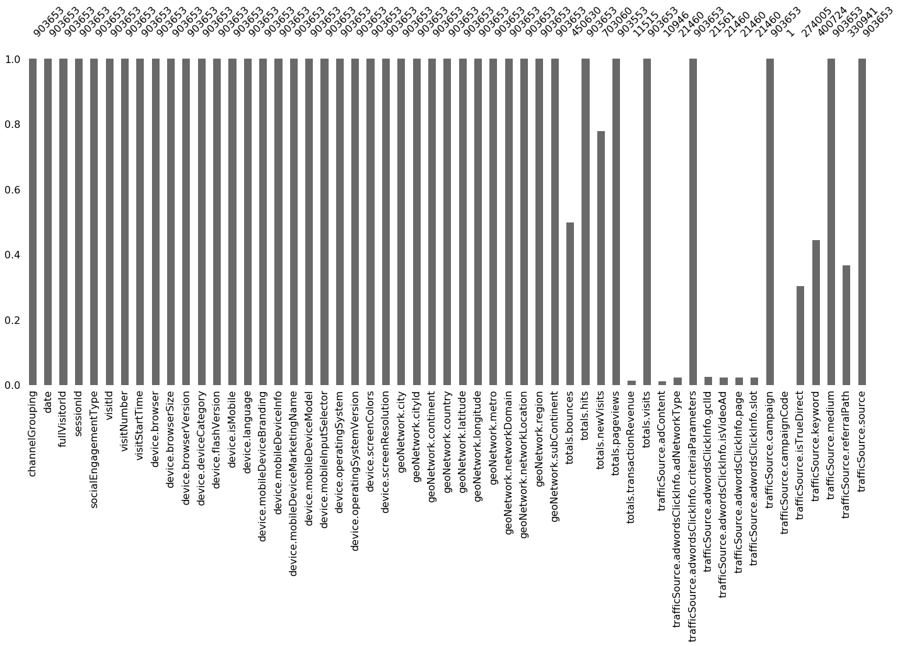
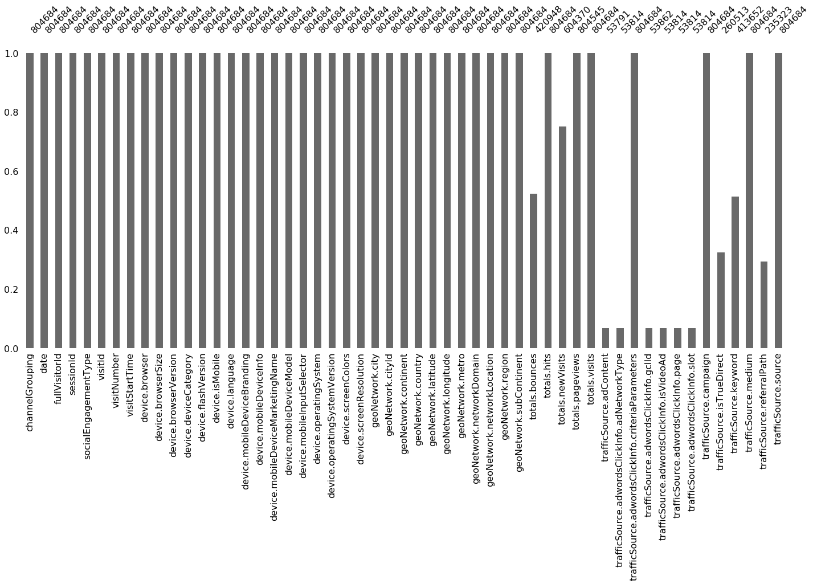
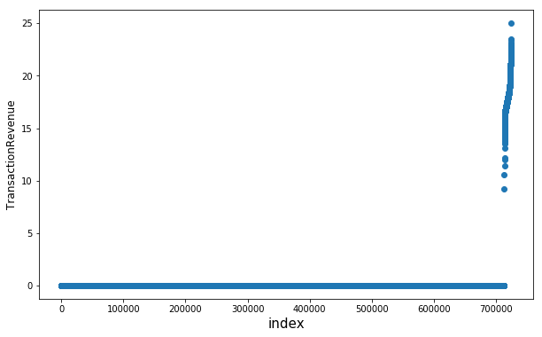
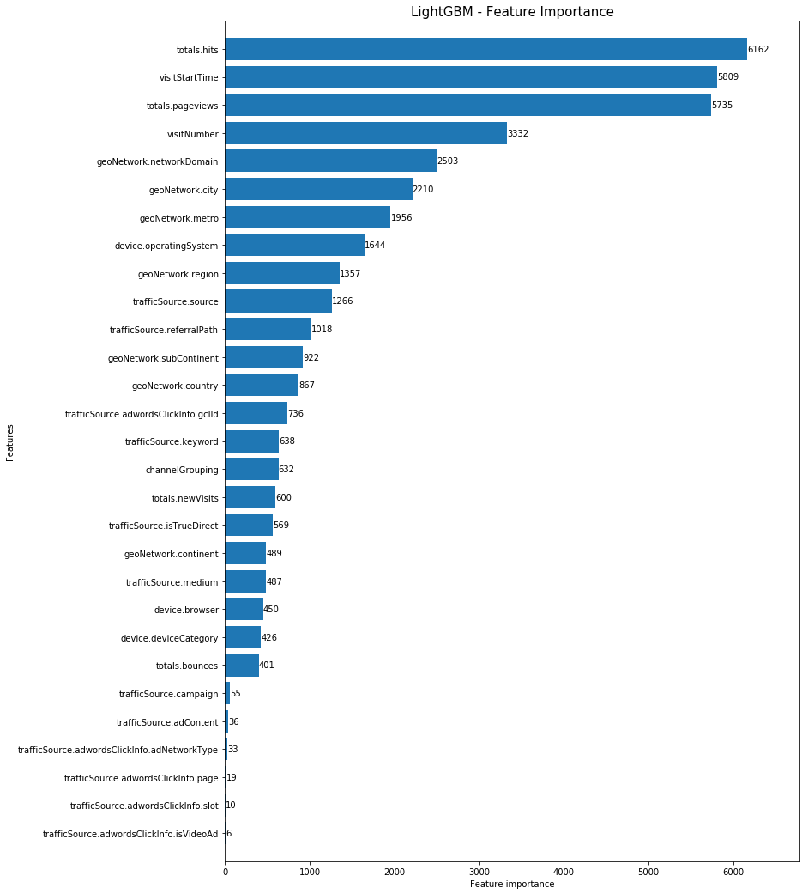

# Goal: If a visitor is going to generate revenue or not
# and If yes how much 

# We are trying to predict revenue per customer 
###### After refering to above general overview we need to 
###### 1 Format the change of data type to reflect actual parameter for e.g Date -mm/dd/yyyy
###### 2 Variables with boolean values can be assigned 0 or 1
###### 3 NaN fields can be replaced with 0 or True or False depending on type of variable
###### 4 fullvisitorId will be considered as independent variable for this analysis, fullvisitorId will be considered as CustomerId
###### 5 totals.transactionRevenue will be the target value to be predicted
###### 6 Certain variables have constant values hence they can removed from this analysis
###### 7 Certain variables are inclusvie datatype for e.g continent -- country -- metro -- city this would allow us to drill down to specific visitorId groups 
###### 8 We will also eliminate the columns that are not in train and test dataset

# 1.1 First we should import necessary packages for this analysis (Updated as required)


```python
import os
import json
import numpy as np
import pandas as pd
from pandas.io.json import json_normalize
import matplotlib.pyplot as plt
import seaborn as sns
color = sns.color_palette()

%matplotlib inline

from plotly import tools
import plotly.offline as py
py.init_notebook_mode(connected=True)
import plotly.graph_objs as go

from sklearn import model_selection, preprocessing, metrics
import lightgbm as lgb

pd.options.mode.chained_assignment = None
pd.options.display.max_columns = 999
import datetime as datetime
```


<script>requirejs.config({paths: { 'plotly': ['https://cdn.plot.ly/plotly-latest.min']},});if(!window.Plotly) {{require(['plotly'],function(plotly) {window.Plotly=plotly;});}}</script>


# 1.2 Importing raw data 


```python
%%time

train=pd.read_csv("/Users/amit/Desktop/Big_data/Capstone/codelab/train.csv")
test=pd.read_csv("/Users/amit/Desktop/Big_data/Capstone/codelab/test.csv")
```

    <string>:2: DtypeWarning:
    
    Columns (3) have mixed types. Specify dtype option on import or set low_memory=False.
    


    CPU times: user 24.4 s, sys: 2.35 s, total: 26.8 s
    Wall time: 27.3 s


# 1.3 Initial Exploratory Data Analysis


##### Checking first five row of train data


```python
train.head()
```


<div>
<style scoped>
    .dataframe tbody tr th:only-of-type {
        vertical-align: middle;
    }

    .dataframe tbody tr th {
        vertical-align: top;
    }

    .dataframe thead th {
        text-align: right;
    }
</style>
<table border="1" class="dataframe">
  <thead>
    <tr style="text-align: right;">
      <th></th>
      <th>channelGrouping</th>
      <th>date</th>
      <th>device</th>
      <th>fullVisitorId</th>
      <th>geoNetwork</th>
      <th>sessionId</th>
      <th>socialEngagementType</th>
      <th>totals</th>
      <th>trafficSource</th>
      <th>visitId</th>
      <th>visitNumber</th>
      <th>visitStartTime</th>
    </tr>
  </thead>
  <tbody>
    <tr>
      <th>0</th>
      <td>Organic Search</td>
      <td>20160902</td>
      <td>{"browser": "Chrome", "browserVersion": "not a...</td>
      <td>1131660440785968503</td>
      <td>{"continent": "Asia", "subContinent": "Western...</td>
      <td>1131660440785968503_1472830385</td>
      <td>Not Socially Engaged</td>
      <td>{"visits": "1", "hits": "1", "pageviews": "1",...</td>
      <td>{"campaign": "(not set)", "source": "google", ...</td>
      <td>1472830385</td>
      <td>1</td>
      <td>1472830385</td>
    </tr>
    <tr>
      <th>1</th>
      <td>Organic Search</td>
      <td>20160902</td>
      <td>{"browser": "Firefox", "browserVersion": "not ...</td>
      <td>377306020877927890</td>
      <td>{"continent": "Oceania", "subContinent": "Aust...</td>
      <td>377306020877927890_1472880147</td>
      <td>Not Socially Engaged</td>
      <td>{"visits": "1", "hits": "1", "pageviews": "1",...</td>
      <td>{"campaign": "(not set)", "source": "google", ...</td>
      <td>1472880147</td>
      <td>1</td>
      <td>1472880147</td>
    </tr>
    <tr>
      <th>2</th>
      <td>Organic Search</td>
      <td>20160902</td>
      <td>{"browser": "Chrome", "browserVersion": "not a...</td>
      <td>3895546263509774583</td>
      <td>{"continent": "Europe", "subContinent": "South...</td>
      <td>3895546263509774583_1472865386</td>
      <td>Not Socially Engaged</td>
      <td>{"visits": "1", "hits": "1", "pageviews": "1",...</td>
      <td>{"campaign": "(not set)", "source": "google", ...</td>
      <td>1472865386</td>
      <td>1</td>
      <td>1472865386</td>
    </tr>
    <tr>
      <th>3</th>
      <td>Organic Search</td>
      <td>20160902</td>
      <td>{"browser": "UC Browser", "browserVersion": "n...</td>
      <td>4763447161404445595</td>
      <td>{"continent": "Asia", "subContinent": "Southea...</td>
      <td>4763447161404445595_1472881213</td>
      <td>Not Socially Engaged</td>
      <td>{"visits": "1", "hits": "1", "pageviews": "1",...</td>
      <td>{"campaign": "(not set)", "source": "google", ...</td>
      <td>1472881213</td>
      <td>1</td>
      <td>1472881213</td>
    </tr>
    <tr>
      <th>4</th>
      <td>Organic Search</td>
      <td>20160902</td>
      <td>{"browser": "Chrome", "browserVersion": "not a...</td>
      <td>27294437909732085</td>
      <td>{"continent": "Europe", "subContinent": "North...</td>
      <td>27294437909732085_1472822600</td>
      <td>Not Socially Engaged</td>
      <td>{"visits": "1", "hits": "1", "pageviews": "1",...</td>
      <td>{"campaign": "(not set)", "source": "google", ...</td>
      <td>1472822600</td>
      <td>2</td>
      <td>1472822600</td>
    </tr>
  </tbody>
</table>
</div>


#### Checking first five row of test data


```python
test.head()
```


<div>
<style scoped>
    .dataframe tbody tr th:only-of-type {
        vertical-align: middle;
    }

    .dataframe tbody tr th {
        vertical-align: top;
    }

    .dataframe thead th {
        text-align: right;
    }
</style>
<table border="1" class="dataframe">
  <thead>
    <tr style="text-align: right;">
      <th></th>
      <th>channelGrouping</th>
      <th>date</th>
      <th>device</th>
      <th>fullVisitorId</th>
      <th>geoNetwork</th>
      <th>sessionId</th>
      <th>socialEngagementType</th>
      <th>totals</th>
      <th>trafficSource</th>
      <th>visitId</th>
      <th>visitNumber</th>
      <th>visitStartTime</th>
    </tr>
  </thead>
  <tbody>
    <tr>
      <th>0</th>
      <td>Organic Search</td>
      <td>20171016</td>
      <td>{"browser": "Chrome", "browserVersion": "not a...</td>
      <td>6167871330617112363</td>
      <td>{"continent": "Asia", "subContinent": "Southea...</td>
      <td>6167871330617112363_1508151024</td>
      <td>Not Socially Engaged</td>
      <td>{"visits": "1", "hits": "4", "pageviews": "4"}</td>
      <td>{"campaign": "(not set)", "source": "google", ...</td>
      <td>1508151024</td>
      <td>2</td>
      <td>1508151024</td>
    </tr>
    <tr>
      <th>1</th>
      <td>Organic Search</td>
      <td>20171016</td>
      <td>{"browser": "Chrome", "browserVersion": "not a...</td>
      <td>0643697640977915618</td>
      <td>{"continent": "Europe", "subContinent": "South...</td>
      <td>0643697640977915618_1508175522</td>
      <td>Not Socially Engaged</td>
      <td>{"visits": "1", "hits": "5", "pageviews": "5",...</td>
      <td>{"campaign": "(not set)", "source": "google", ...</td>
      <td>1508175522</td>
      <td>1</td>
      <td>1508175522</td>
    </tr>
    <tr>
      <th>2</th>
      <td>Organic Search</td>
      <td>20171016</td>
      <td>{"browser": "Chrome", "browserVersion": "not a...</td>
      <td>6059383810968229466</td>
      <td>{"continent": "Europe", "subContinent": "Weste...</td>
      <td>6059383810968229466_1508143220</td>
      <td>Not Socially Engaged</td>
      <td>{"visits": "1", "hits": "7", "pageviews": "7",...</td>
      <td>{"campaign": "(not set)", "source": "google", ...</td>
      <td>1508143220</td>
      <td>1</td>
      <td>1508143220</td>
    </tr>
    <tr>
      <th>3</th>
      <td>Organic Search</td>
      <td>20171016</td>
      <td>{"browser": "Safari", "browserVersion": "not a...</td>
      <td>2376720078563423631</td>
      <td>{"continent": "Americas", "subContinent": "Nor...</td>
      <td>2376720078563423631_1508193530</td>
      <td>Not Socially Engaged</td>
      <td>{"visits": "1", "hits": "8", "pageviews": "4",...</td>
      <td>{"campaign": "(not set)", "source": "google", ...</td>
      <td>1508193530</td>
      <td>1</td>
      <td>1508193530</td>
    </tr>
    <tr>
      <th>4</th>
      <td>Organic Search</td>
      <td>20171016</td>
      <td>{"browser": "Safari", "browserVersion": "not a...</td>
      <td>2314544520795440038</td>
      <td>{"continent": "Americas", "subContinent": "Nor...</td>
      <td>2314544520795440038_1508217442</td>
      <td>Not Socially Engaged</td>
      <td>{"visits": "1", "hits": "9", "pageviews": "4",...</td>
      <td>{"campaign": "(not set)", "source": "google", ...</td>
      <td>1508217442</td>
      <td>1</td>
      <td>1508217442</td>
    </tr>
  </tbody>
</table>
</div>


##### As we can see there are four columns both in train and test set which has json format which we will try to transform in next step

### As we can see in above snapshot of datset that four out of 12 columns have json format data which we will try to flatten and list them in individual columns 

# Cleansing part-1
#### Parsing the all the columns having json format data 

#### I found a function written a kaggler Julian reference to his work is in link below 

https://www.kaggle.com/julian3833/1-quick-start-read-csv-and-flatten-json-fields/notebook


```python
def load_df(csv_path='../input/train.csv', nrows=None):
    JSON_COLUMNS = ['device', 'geoNetwork', 'totals', 'trafficSource']
    
    df = pd.read_csv(csv_path, 
                     converters={column: json.loads for column in JSON_COLUMNS}, 
                     dtype={'fullVisitorId': 'str'}, # Important!!
                     nrows=nrows)
    
    for column in JSON_COLUMNS:
        column_as_df = json_normalize(df[column])
        column_as_df.columns = [f"{column}.{subcolumn}" for subcolumn in column_as_df.columns]
        df = df.drop(column, axis=1).merge(column_as_df, right_index=True, left_index=True)
    print(f"Loaded {os.path.basename(csv_path)}. Shape: {df.shape}")
    return df
```

# json_normalize: python has nice example for what it does


### Applying the above created function on raw data to clean json format columns


```python
%%time
train01 = load_df("/Users/amit/Desktop/Big_data/Capstone/codelab/train.csv")
test01 = load_df("/Users/amit/Desktop/Big_data/Capstone/codelab/test.csv")
```

    Loaded train.csv. Shape: (903653, 55)
    Loaded test.csv. Shape: (804684, 53)
    CPU times: user 6min 19s, sys: 1min 54s, total: 8min 14s
    Wall time: 8min 47s


### Checking the cleaned data


```python
train01.head()
```


<div>
<style scoped>
    .dataframe tbody tr th:only-of-type {
        vertical-align: middle;
    }

    .dataframe tbody tr th {
        vertical-align: top;
    }

    .dataframe thead th {
        text-align: right;
    }
</style>
<table border="1" class="dataframe">
  <thead>
    <tr style="text-align: right;">
      <th></th>
      <th>channelGrouping</th>
      <th>date</th>
      <th>fullVisitorId</th>
      <th>sessionId</th>
      <th>socialEngagementType</th>
      <th>visitId</th>
      <th>visitNumber</th>
      <th>visitStartTime</th>
      <th>device.browser</th>
      <th>device.browserSize</th>
      <th>device.browserVersion</th>
      <th>device.deviceCategory</th>
      <th>device.flashVersion</th>
      <th>device.isMobile</th>
      <th>device.language</th>
      <th>device.mobileDeviceBranding</th>
      <th>device.mobileDeviceInfo</th>
      <th>device.mobileDeviceMarketingName</th>
      <th>device.mobileDeviceModel</th>
      <th>device.mobileInputSelector</th>
      <th>device.operatingSystem</th>
      <th>device.operatingSystemVersion</th>
      <th>device.screenColors</th>
      <th>device.screenResolution</th>
      <th>geoNetwork.city</th>
      <th>geoNetwork.cityId</th>
      <th>geoNetwork.continent</th>
      <th>geoNetwork.country</th>
      <th>geoNetwork.latitude</th>
      <th>geoNetwork.longitude</th>
      <th>geoNetwork.metro</th>
      <th>geoNetwork.networkDomain</th>
      <th>geoNetwork.networkLocation</th>
      <th>geoNetwork.region</th>
      <th>geoNetwork.subContinent</th>
      <th>totals.bounces</th>
      <th>totals.hits</th>
      <th>totals.newVisits</th>
      <th>totals.pageviews</th>
      <th>totals.transactionRevenue</th>
      <th>totals.visits</th>
      <th>trafficSource.adContent</th>
      <th>trafficSource.adwordsClickInfo.adNetworkType</th>
      <th>trafficSource.adwordsClickInfo.criteriaParameters</th>
      <th>trafficSource.adwordsClickInfo.gclId</th>
      <th>trafficSource.adwordsClickInfo.isVideoAd</th>
      <th>trafficSource.adwordsClickInfo.page</th>
      <th>trafficSource.adwordsClickInfo.slot</th>
      <th>trafficSource.campaign</th>
      <th>trafficSource.campaignCode</th>
      <th>trafficSource.isTrueDirect</th>
      <th>trafficSource.keyword</th>
      <th>trafficSource.medium</th>
      <th>trafficSource.referralPath</th>
      <th>trafficSource.source</th>
    </tr>
  </thead>
  <tbody>
    <tr>
      <th>0</th>
      <td>Organic Search</td>
      <td>20160902</td>
      <td>1131660440785968503</td>
      <td>1131660440785968503_1472830385</td>
      <td>Not Socially Engaged</td>
      <td>1472830385</td>
      <td>1</td>
      <td>1472830385</td>
      <td>Chrome</td>
      <td>not available in demo dataset</td>
      <td>not available in demo dataset</td>
      <td>desktop</td>
      <td>not available in demo dataset</td>
      <td>False</td>
      <td>not available in demo dataset</td>
      <td>not available in demo dataset</td>
      <td>not available in demo dataset</td>
      <td>not available in demo dataset</td>
      <td>not available in demo dataset</td>
      <td>not available in demo dataset</td>
      <td>Windows</td>
      <td>not available in demo dataset</td>
      <td>not available in demo dataset</td>
      <td>not available in demo dataset</td>
      <td>Izmir</td>
      <td>not available in demo dataset</td>
      <td>Asia</td>
      <td>Turkey</td>
      <td>not available in demo dataset</td>
      <td>not available in demo dataset</td>
      <td>(not set)</td>
      <td>ttnet.com.tr</td>
      <td>not available in demo dataset</td>
      <td>Izmir</td>
      <td>Western Asia</td>
      <td>1</td>
      <td>1</td>
      <td>1</td>
      <td>1</td>
      <td>NaN</td>
      <td>1</td>
      <td>NaN</td>
      <td>NaN</td>
      <td>not available in demo dataset</td>
      <td>NaN</td>
      <td>NaN</td>
      <td>NaN</td>
      <td>NaN</td>
      <td>(not set)</td>
      <td>NaN</td>
      <td>NaN</td>
      <td>(not provided)</td>
      <td>organic</td>
      <td>NaN</td>
      <td>google</td>
    </tr>
    <tr>
      <th>1</th>
      <td>Organic Search</td>
      <td>20160902</td>
      <td>377306020877927890</td>
      <td>377306020877927890_1472880147</td>
      <td>Not Socially Engaged</td>
      <td>1472880147</td>
      <td>1</td>
      <td>1472880147</td>
      <td>Firefox</td>
      <td>not available in demo dataset</td>
      <td>not available in demo dataset</td>
      <td>desktop</td>
      <td>not available in demo dataset</td>
      <td>False</td>
      <td>not available in demo dataset</td>
      <td>not available in demo dataset</td>
      <td>not available in demo dataset</td>
      <td>not available in demo dataset</td>
      <td>not available in demo dataset</td>
      <td>not available in demo dataset</td>
      <td>Macintosh</td>
      <td>not available in demo dataset</td>
      <td>not available in demo dataset</td>
      <td>not available in demo dataset</td>
      <td>not available in demo dataset</td>
      <td>not available in demo dataset</td>
      <td>Oceania</td>
      <td>Australia</td>
      <td>not available in demo dataset</td>
      <td>not available in demo dataset</td>
      <td>not available in demo dataset</td>
      <td>dodo.net.au</td>
      <td>not available in demo dataset</td>
      <td>not available in demo dataset</td>
      <td>Australasia</td>
      <td>1</td>
      <td>1</td>
      <td>1</td>
      <td>1</td>
      <td>NaN</td>
      <td>1</td>
      <td>NaN</td>
      <td>NaN</td>
      <td>not available in demo dataset</td>
      <td>NaN</td>
      <td>NaN</td>
      <td>NaN</td>
      <td>NaN</td>
      <td>(not set)</td>
      <td>NaN</td>
      <td>NaN</td>
      <td>(not provided)</td>
      <td>organic</td>
      <td>NaN</td>
      <td>google</td>
    </tr>
    <tr>
      <th>2</th>
      <td>Organic Search</td>
      <td>20160902</td>
      <td>3895546263509774583</td>
      <td>3895546263509774583_1472865386</td>
      <td>Not Socially Engaged</td>
      <td>1472865386</td>
      <td>1</td>
      <td>1472865386</td>
      <td>Chrome</td>
      <td>not available in demo dataset</td>
      <td>not available in demo dataset</td>
      <td>desktop</td>
      <td>not available in demo dataset</td>
      <td>False</td>
      <td>not available in demo dataset</td>
      <td>not available in demo dataset</td>
      <td>not available in demo dataset</td>
      <td>not available in demo dataset</td>
      <td>not available in demo dataset</td>
      <td>not available in demo dataset</td>
      <td>Windows</td>
      <td>not available in demo dataset</td>
      <td>not available in demo dataset</td>
      <td>not available in demo dataset</td>
      <td>Madrid</td>
      <td>not available in demo dataset</td>
      <td>Europe</td>
      <td>Spain</td>
      <td>not available in demo dataset</td>
      <td>not available in demo dataset</td>
      <td>(not set)</td>
      <td>unknown.unknown</td>
      <td>not available in demo dataset</td>
      <td>Community of Madrid</td>
      <td>Southern Europe</td>
      <td>1</td>
      <td>1</td>
      <td>1</td>
      <td>1</td>
      <td>NaN</td>
      <td>1</td>
      <td>NaN</td>
      <td>NaN</td>
      <td>not available in demo dataset</td>
      <td>NaN</td>
      <td>NaN</td>
      <td>NaN</td>
      <td>NaN</td>
      <td>(not set)</td>
      <td>NaN</td>
      <td>NaN</td>
      <td>(not provided)</td>
      <td>organic</td>
      <td>NaN</td>
      <td>google</td>
    </tr>
    <tr>
      <th>3</th>
      <td>Organic Search</td>
      <td>20160902</td>
      <td>4763447161404445595</td>
      <td>4763447161404445595_1472881213</td>
      <td>Not Socially Engaged</td>
      <td>1472881213</td>
      <td>1</td>
      <td>1472881213</td>
      <td>UC Browser</td>
      <td>not available in demo dataset</td>
      <td>not available in demo dataset</td>
      <td>desktop</td>
      <td>not available in demo dataset</td>
      <td>False</td>
      <td>not available in demo dataset</td>
      <td>not available in demo dataset</td>
      <td>not available in demo dataset</td>
      <td>not available in demo dataset</td>
      <td>not available in demo dataset</td>
      <td>not available in demo dataset</td>
      <td>Linux</td>
      <td>not available in demo dataset</td>
      <td>not available in demo dataset</td>
      <td>not available in demo dataset</td>
      <td>not available in demo dataset</td>
      <td>not available in demo dataset</td>
      <td>Asia</td>
      <td>Indonesia</td>
      <td>not available in demo dataset</td>
      <td>not available in demo dataset</td>
      <td>not available in demo dataset</td>
      <td>unknown.unknown</td>
      <td>not available in demo dataset</td>
      <td>not available in demo dataset</td>
      <td>Southeast Asia</td>
      <td>1</td>
      <td>1</td>
      <td>1</td>
      <td>1</td>
      <td>NaN</td>
      <td>1</td>
      <td>NaN</td>
      <td>NaN</td>
      <td>not available in demo dataset</td>
      <td>NaN</td>
      <td>NaN</td>
      <td>NaN</td>
      <td>NaN</td>
      <td>(not set)</td>
      <td>NaN</td>
      <td>NaN</td>
      <td>google + online</td>
      <td>organic</td>
      <td>NaN</td>
      <td>google</td>
    </tr>
    <tr>
      <th>4</th>
      <td>Organic Search</td>
      <td>20160902</td>
      <td>27294437909732085</td>
      <td>27294437909732085_1472822600</td>
      <td>Not Socially Engaged</td>
      <td>1472822600</td>
      <td>2</td>
      <td>1472822600</td>
      <td>Chrome</td>
      <td>not available in demo dataset</td>
      <td>not available in demo dataset</td>
      <td>mobile</td>
      <td>not available in demo dataset</td>
      <td>True</td>
      <td>not available in demo dataset</td>
      <td>not available in demo dataset</td>
      <td>not available in demo dataset</td>
      <td>not available in demo dataset</td>
      <td>not available in demo dataset</td>
      <td>not available in demo dataset</td>
      <td>Android</td>
      <td>not available in demo dataset</td>
      <td>not available in demo dataset</td>
      <td>not available in demo dataset</td>
      <td>not available in demo dataset</td>
      <td>not available in demo dataset</td>
      <td>Europe</td>
      <td>United Kingdom</td>
      <td>not available in demo dataset</td>
      <td>not available in demo dataset</td>
      <td>not available in demo dataset</td>
      <td>unknown.unknown</td>
      <td>not available in demo dataset</td>
      <td>not available in demo dataset</td>
      <td>Northern Europe</td>
      <td>1</td>
      <td>1</td>
      <td>NaN</td>
      <td>1</td>
      <td>NaN</td>
      <td>1</td>
      <td>NaN</td>
      <td>NaN</td>
      <td>not available in demo dataset</td>
      <td>NaN</td>
      <td>NaN</td>
      <td>NaN</td>
      <td>NaN</td>
      <td>(not set)</td>
      <td>NaN</td>
      <td>True</td>
      <td>(not provided)</td>
      <td>organic</td>
      <td>NaN</td>
      <td>google</td>
    </tr>
  </tbody>
</table>
</div>


### As we can see the data is transformed 


```python
test01.head()
```


<div>
<style scoped>
    .dataframe tbody tr th:only-of-type {
        vertical-align: middle;
    }

    .dataframe tbody tr th {
        vertical-align: top;
    }

    .dataframe thead th {
        text-align: right;
    }
</style>
<table border="1" class="dataframe">
  <thead>
    <tr style="text-align: right;">
      <th></th>
      <th>channelGrouping</th>
      <th>date</th>
      <th>fullVisitorId</th>
      <th>sessionId</th>
      <th>socialEngagementType</th>
      <th>visitId</th>
      <th>visitNumber</th>
      <th>visitStartTime</th>
      <th>device.browser</th>
      <th>device.browserSize</th>
      <th>device.browserVersion</th>
      <th>device.deviceCategory</th>
      <th>device.flashVersion</th>
      <th>device.isMobile</th>
      <th>device.language</th>
      <th>device.mobileDeviceBranding</th>
      <th>device.mobileDeviceInfo</th>
      <th>device.mobileDeviceMarketingName</th>
      <th>device.mobileDeviceModel</th>
      <th>device.mobileInputSelector</th>
      <th>device.operatingSystem</th>
      <th>device.operatingSystemVersion</th>
      <th>device.screenColors</th>
      <th>device.screenResolution</th>
      <th>geoNetwork.city</th>
      <th>geoNetwork.cityId</th>
      <th>geoNetwork.continent</th>
      <th>geoNetwork.country</th>
      <th>geoNetwork.latitude</th>
      <th>geoNetwork.longitude</th>
      <th>geoNetwork.metro</th>
      <th>geoNetwork.networkDomain</th>
      <th>geoNetwork.networkLocation</th>
      <th>geoNetwork.region</th>
      <th>geoNetwork.subContinent</th>
      <th>totals.bounces</th>
      <th>totals.hits</th>
      <th>totals.newVisits</th>
      <th>totals.pageviews</th>
      <th>totals.visits</th>
      <th>trafficSource.adContent</th>
      <th>trafficSource.adwordsClickInfo.adNetworkType</th>
      <th>trafficSource.adwordsClickInfo.criteriaParameters</th>
      <th>trafficSource.adwordsClickInfo.gclId</th>
      <th>trafficSource.adwordsClickInfo.isVideoAd</th>
      <th>trafficSource.adwordsClickInfo.page</th>
      <th>trafficSource.adwordsClickInfo.slot</th>
      <th>trafficSource.campaign</th>
      <th>trafficSource.isTrueDirect</th>
      <th>trafficSource.keyword</th>
      <th>trafficSource.medium</th>
      <th>trafficSource.referralPath</th>
      <th>trafficSource.source</th>
    </tr>
  </thead>
  <tbody>
    <tr>
      <th>0</th>
      <td>Organic Search</td>
      <td>20171016</td>
      <td>6167871330617112363</td>
      <td>6167871330617112363_1508151024</td>
      <td>Not Socially Engaged</td>
      <td>1508151024</td>
      <td>2</td>
      <td>1508151024</td>
      <td>Chrome</td>
      <td>not available in demo dataset</td>
      <td>not available in demo dataset</td>
      <td>desktop</td>
      <td>not available in demo dataset</td>
      <td>False</td>
      <td>not available in demo dataset</td>
      <td>not available in demo dataset</td>
      <td>not available in demo dataset</td>
      <td>not available in demo dataset</td>
      <td>not available in demo dataset</td>
      <td>not available in demo dataset</td>
      <td>Macintosh</td>
      <td>not available in demo dataset</td>
      <td>not available in demo dataset</td>
      <td>not available in demo dataset</td>
      <td>(not set)</td>
      <td>not available in demo dataset</td>
      <td>Asia</td>
      <td>Singapore</td>
      <td>not available in demo dataset</td>
      <td>not available in demo dataset</td>
      <td>(not set)</td>
      <td>myrepublic.com.sg</td>
      <td>not available in demo dataset</td>
      <td>(not set)</td>
      <td>Southeast Asia</td>
      <td>NaN</td>
      <td>4</td>
      <td>NaN</td>
      <td>4</td>
      <td>1</td>
      <td>NaN</td>
      <td>NaN</td>
      <td>not available in demo dataset</td>
      <td>NaN</td>
      <td>NaN</td>
      <td>NaN</td>
      <td>NaN</td>
      <td>(not set)</td>
      <td>True</td>
      <td>(not provided)</td>
      <td>organic</td>
      <td>NaN</td>
      <td>google</td>
    </tr>
    <tr>
      <th>1</th>
      <td>Organic Search</td>
      <td>20171016</td>
      <td>0643697640977915618</td>
      <td>0643697640977915618_1508175522</td>
      <td>Not Socially Engaged</td>
      <td>1508175522</td>
      <td>1</td>
      <td>1508175522</td>
      <td>Chrome</td>
      <td>not available in demo dataset</td>
      <td>not available in demo dataset</td>
      <td>desktop</td>
      <td>not available in demo dataset</td>
      <td>False</td>
      <td>not available in demo dataset</td>
      <td>not available in demo dataset</td>
      <td>not available in demo dataset</td>
      <td>not available in demo dataset</td>
      <td>not available in demo dataset</td>
      <td>not available in demo dataset</td>
      <td>Windows</td>
      <td>not available in demo dataset</td>
      <td>not available in demo dataset</td>
      <td>not available in demo dataset</td>
      <td>Zaragoza</td>
      <td>not available in demo dataset</td>
      <td>Europe</td>
      <td>Spain</td>
      <td>not available in demo dataset</td>
      <td>not available in demo dataset</td>
      <td>(not set)</td>
      <td>rima-tde.net</td>
      <td>not available in demo dataset</td>
      <td>Aragon</td>
      <td>Southern Europe</td>
      <td>NaN</td>
      <td>5</td>
      <td>1</td>
      <td>5</td>
      <td>1</td>
      <td>NaN</td>
      <td>NaN</td>
      <td>not available in demo dataset</td>
      <td>NaN</td>
      <td>NaN</td>
      <td>NaN</td>
      <td>NaN</td>
      <td>(not set)</td>
      <td>NaN</td>
      <td>(not provided)</td>
      <td>organic</td>
      <td>NaN</td>
      <td>google</td>
    </tr>
    <tr>
      <th>2</th>
      <td>Organic Search</td>
      <td>20171016</td>
      <td>6059383810968229466</td>
      <td>6059383810968229466_1508143220</td>
      <td>Not Socially Engaged</td>
      <td>1508143220</td>
      <td>1</td>
      <td>1508143220</td>
      <td>Chrome</td>
      <td>not available in demo dataset</td>
      <td>not available in demo dataset</td>
      <td>desktop</td>
      <td>not available in demo dataset</td>
      <td>False</td>
      <td>not available in demo dataset</td>
      <td>not available in demo dataset</td>
      <td>not available in demo dataset</td>
      <td>not available in demo dataset</td>
      <td>not available in demo dataset</td>
      <td>not available in demo dataset</td>
      <td>Macintosh</td>
      <td>not available in demo dataset</td>
      <td>not available in demo dataset</td>
      <td>not available in demo dataset</td>
      <td>not available in demo dataset</td>
      <td>not available in demo dataset</td>
      <td>Europe</td>
      <td>France</td>
      <td>not available in demo dataset</td>
      <td>not available in demo dataset</td>
      <td>not available in demo dataset</td>
      <td>sfr.net</td>
      <td>not available in demo dataset</td>
      <td>not available in demo dataset</td>
      <td>Western Europe</td>
      <td>NaN</td>
      <td>7</td>
      <td>1</td>
      <td>7</td>
      <td>1</td>
      <td>NaN</td>
      <td>NaN</td>
      <td>not available in demo dataset</td>
      <td>NaN</td>
      <td>NaN</td>
      <td>NaN</td>
      <td>NaN</td>
      <td>(not set)</td>
      <td>NaN</td>
      <td>(not provided)</td>
      <td>organic</td>
      <td>NaN</td>
      <td>google</td>
    </tr>
    <tr>
      <th>3</th>
      <td>Organic Search</td>
      <td>20171016</td>
      <td>2376720078563423631</td>
      <td>2376720078563423631_1508193530</td>
      <td>Not Socially Engaged</td>
      <td>1508193530</td>
      <td>1</td>
      <td>1508193530</td>
      <td>Safari</td>
      <td>not available in demo dataset</td>
      <td>not available in demo dataset</td>
      <td>mobile</td>
      <td>not available in demo dataset</td>
      <td>True</td>
      <td>not available in demo dataset</td>
      <td>not available in demo dataset</td>
      <td>not available in demo dataset</td>
      <td>not available in demo dataset</td>
      <td>not available in demo dataset</td>
      <td>not available in demo dataset</td>
      <td>iOS</td>
      <td>not available in demo dataset</td>
      <td>not available in demo dataset</td>
      <td>not available in demo dataset</td>
      <td>Mountain View</td>
      <td>not available in demo dataset</td>
      <td>Americas</td>
      <td>United States</td>
      <td>not available in demo dataset</td>
      <td>not available in demo dataset</td>
      <td>San Francisco-Oakland-San Jose CA</td>
      <td>(not set)</td>
      <td>not available in demo dataset</td>
      <td>California</td>
      <td>Northern America</td>
      <td>NaN</td>
      <td>8</td>
      <td>1</td>
      <td>4</td>
      <td>1</td>
      <td>NaN</td>
      <td>NaN</td>
      <td>not available in demo dataset</td>
      <td>NaN</td>
      <td>NaN</td>
      <td>NaN</td>
      <td>NaN</td>
      <td>(not set)</td>
      <td>NaN</td>
      <td>(not provided)</td>
      <td>organic</td>
      <td>NaN</td>
      <td>google</td>
    </tr>
    <tr>
      <th>4</th>
      <td>Organic Search</td>
      <td>20171016</td>
      <td>2314544520795440038</td>
      <td>2314544520795440038_1508217442</td>
      <td>Not Socially Engaged</td>
      <td>1508217442</td>
      <td>1</td>
      <td>1508217442</td>
      <td>Safari</td>
      <td>not available in demo dataset</td>
      <td>not available in demo dataset</td>
      <td>desktop</td>
      <td>not available in demo dataset</td>
      <td>False</td>
      <td>not available in demo dataset</td>
      <td>not available in demo dataset</td>
      <td>not available in demo dataset</td>
      <td>not available in demo dataset</td>
      <td>not available in demo dataset</td>
      <td>not available in demo dataset</td>
      <td>Macintosh</td>
      <td>not available in demo dataset</td>
      <td>not available in demo dataset</td>
      <td>not available in demo dataset</td>
      <td>San Jose</td>
      <td>not available in demo dataset</td>
      <td>Americas</td>
      <td>United States</td>
      <td>not available in demo dataset</td>
      <td>not available in demo dataset</td>
      <td>San Francisco-Oakland-San Jose CA</td>
      <td>(not set)</td>
      <td>not available in demo dataset</td>
      <td>California</td>
      <td>Northern America</td>
      <td>NaN</td>
      <td>9</td>
      <td>1</td>
      <td>4</td>
      <td>1</td>
      <td>NaN</td>
      <td>NaN</td>
      <td>not available in demo dataset</td>
      <td>NaN</td>
      <td>NaN</td>
      <td>NaN</td>
      <td>NaN</td>
      <td>(not set)</td>
      <td>NaN</td>
      <td>(not provided)</td>
      <td>organic</td>
      <td>NaN</td>
      <td>google</td>
    </tr>
  </tbody>
</table>
</div>


### After processing parser function the size of train and test csv files are half the size now


### We will make a copy of the transformed data and reload it because jupyter notebook doesn't save the variables


```python
%%time
train01.to_csv("train1.csv",index=False)
test01.to_csv("test1.csv",index=False)
```

    CPU times: user 1min 18s, sys: 19.9 s, total: 1min 38s
    Wall time: 1min 51s


### Loading processed train and test files


```python
%%time
train02=pd.read_csv("/Users/amit/Desktop/Big_data/Capstone/codelab/train1.csv")
test02=pd.read_csv("/Users/amit/Desktop/Big_data/Capstone/codelab/test1.csv")
```

    <string>:2: DtypeWarning:
    
    Columns (2,49) have mixed types. Specify dtype option on import or set low_memory=False.
    
    <string>:2: DtypeWarning:
    
    Columns (2) have mixed types. Specify dtype option on import or set low_memory=False.
    


    CPU times: user 34 s, sys: 6.24 s, total: 40.3 s
    Wall time: 41.8 s


# Visualization part-1 
### 2.4 Nice package for looking at missing values in dataset
###  Package is called   ==>    "" missingno""


```python
import missingno as msno
```


```python
msno.bar(train02)
```


    <matplotlib.axes._subplots.AxesSubplot at 0x1bfea2c208>





```python
msno.bar(test02)
```


    <matplotlib.axes._subplots.AxesSubplot at 0x1bfc2f7240>





```python
train02.info()
```

    <class 'pandas.core.frame.DataFrame'>
    RangeIndex: 903653 entries, 0 to 903652
    Data columns (total 55 columns):
    channelGrouping                                      903653 non-null object
    date                                                 903653 non-null object
    fullVisitorId                                        903653 non-null object
    sessionId                                            903653 non-null object
    socialEngagementType                                 903653 non-null object
    visitId                                              903653 non-null int64
    visitNumber                                          903653 non-null int64
    visitStartTime                                       903653 non-null int64
    device.browser                                       903653 non-null object
    device.browserSize                                   903653 non-null object
    device.browserVersion                                903653 non-null object
    device.deviceCategory                                903653 non-null object
    device.flashVersion                                  903653 non-null object
    device.isMobile                                      903653 non-null bool
    device.language                                      903653 non-null object
    device.mobileDeviceBranding                          903653 non-null object
    device.mobileDeviceInfo                              903653 non-null object
    device.mobileDeviceMarketingName                     903653 non-null object
    device.mobileDeviceModel                             903653 non-null object
    device.mobileInputSelector                           903653 non-null object
    device.operatingSystem                               903653 non-null object
    device.operatingSystemVersion                        903653 non-null object
    device.screenColors                                  903653 non-null object
    device.screenResolution                              903653 non-null object
    geoNetwork.city                                      903653 non-null object
    geoNetwork.cityId                                    903653 non-null object
    geoNetwork.continent                                 903653 non-null object
    geoNetwork.country                                   903653 non-null object
    geoNetwork.latitude                                  903653 non-null object
    geoNetwork.longitude                                 903653 non-null object
    geoNetwork.metro                                     903653 non-null object
    geoNetwork.networkDomain                             903653 non-null object
    geoNetwork.networkLocation                           903653 non-null object
    geoNetwork.region                                    903653 non-null object
    geoNetwork.subContinent                              903653 non-null object
    totals.bounces                                       450630 non-null float64
    totals.hits                                          903653 non-null int64
    totals.newVisits                                     703060 non-null float64
    totals.pageviews                                     903553 non-null float64
    totals.transactionRevenue                            11515 non-null float64
    totals.visits                                        903653 non-null int64
    trafficSource.adContent                              10946 non-null object
    trafficSource.adwordsClickInfo.adNetworkType         21460 non-null object
    trafficSource.adwordsClickInfo.criteriaParameters    903653 non-null object
    trafficSource.adwordsClickInfo.gclId                 21561 non-null object
    trafficSource.adwordsClickInfo.isVideoAd             21460 non-null object
    trafficSource.adwordsClickInfo.page                  21460 non-null float64
    trafficSource.adwordsClickInfo.slot                  21460 non-null object
    trafficSource.campaign                               903653 non-null object
    trafficSource.campaignCode                           1 non-null object
    trafficSource.isTrueDirect                           274005 non-null object
    trafficSource.keyword                                400724 non-null object
    trafficSource.medium                                 903653 non-null object
    trafficSource.referralPath                           330941 non-null object
    trafficSource.source                                 903653 non-null object
    dtypes: bool(1), float64(5), int64(5), object(44)
    memory usage: 373.2+ MB


```python
test02.info()
```

    <class 'pandas.core.frame.DataFrame'>
    RangeIndex: 804684 entries, 0 to 804683
    Data columns (total 53 columns):
    channelGrouping                                      804684 non-null object
    date                                                 804684 non-null object
    fullVisitorId                                        804684 non-null object
    sessionId                                            804684 non-null object
    socialEngagementType                                 804684 non-null object
    visitId                                              804684 non-null int64
    visitNumber                                          804684 non-null int64
    visitStartTime                                       804684 non-null int64
    device.browser                                       804684 non-null object
    device.browserSize                                   804684 non-null object
    device.browserVersion                                804684 non-null object
    device.deviceCategory                                804684 non-null object
    device.flashVersion                                  804684 non-null object
    device.isMobile                                      804684 non-null bool
    device.language                                      804684 non-null object
    device.mobileDeviceBranding                          804684 non-null object
    device.mobileDeviceInfo                              804684 non-null object
    device.mobileDeviceMarketingName                     804684 non-null object
    device.mobileDeviceModel                             804684 non-null object
    device.mobileInputSelector                           804684 non-null object
    device.operatingSystem                               804684 non-null object
    device.operatingSystemVersion                        804684 non-null object
    device.screenColors                                  804684 non-null object
    device.screenResolution                              804684 non-null object
    geoNetwork.city                                      804684 non-null object
    geoNetwork.cityId                                    804684 non-null object
    geoNetwork.continent                                 804684 non-null object
    geoNetwork.country                                   804684 non-null object
    geoNetwork.latitude                                  804684 non-null object
    geoNetwork.longitude                                 804684 non-null object
    geoNetwork.metro                                     804684 non-null object
    geoNetwork.networkDomain                             804684 non-null object
    geoNetwork.networkLocation                           804684 non-null object
    geoNetwork.region                                    804684 non-null object
    geoNetwork.subContinent                              804684 non-null object
    totals.bounces                                       420948 non-null float64
    totals.hits                                          804684 non-null int64
    totals.newVisits                                     604370 non-null float64
    totals.pageviews                                     804545 non-null float64
    totals.visits                                        804684 non-null int64
    trafficSource.adContent                              53791 non-null object
    trafficSource.adwordsClickInfo.adNetworkType         53814 non-null object
    trafficSource.adwordsClickInfo.criteriaParameters    804684 non-null object
    trafficSource.adwordsClickInfo.gclId                 53862 non-null object
    trafficSource.adwordsClickInfo.isVideoAd             53814 non-null object
    trafficSource.adwordsClickInfo.page                  53814 non-null float64
    trafficSource.adwordsClickInfo.slot                  53814 non-null object
    trafficSource.campaign                               804684 non-null object
    trafficSource.isTrueDirect                           260513 non-null object
    trafficSource.keyword                                413652 non-null object
    trafficSource.medium                                 804684 non-null object
    trafficSource.referralPath                           235323 non-null object
    trafficSource.source                                 804684 non-null object
    dtypes: bool(1), float64(4), int64(5), object(43)
    memory usage: 320.0+ MB


## As we can see there are a 10 columns with missing values which we will try to replace with numeric or logical place holders

### We will try to see visually how many user who visited website did buy something

### Below chart explains the number of visitors actually is generating revenue for gstore(target population)


```python
train02["totals.transactionRevenue"] = train02["totals.transactionRevenue"].astype('float')
gdf = train02.groupby("fullVisitorId")["totals.transactionRevenue"].sum().reset_index()

plt.figure(figsize=(10,6))
plt.scatter(range(gdf.shape[0]), np.sort(np.log1p(gdf["totals.transactionRevenue"].values)))
plt.xlabel('index', fontsize=15)
plt.ylabel('TransactionRevenue', fontsize=12)
plt.show()
```





## Since the number of customer's generating revenue is low we should check the strength of this target group in train and test dataset (helped us in selecting training and validation split also fine tunning Gradient Boosting Models)

### Here we will explore upon how many non zero transactions were made have and how many were unique from them


```python
nzincome = pd.notnull(train02["totals.transactionRevenue"]).sum()
nzrevenue = (gdf["totals.transactionRevenue"]>0).sum()
print("Number of instances in train set with non-zero revenue : ", nzincome, " and ratio is : ", nzincome / train02.shape[0])
print("Number of unique customers with non-zero revenue : ", nzrevenue, "and the ratio is : ", nzrevenue / gdf.shape[0])
```

    Number of instances in train set with non-zero revenue :  11515  and ratio is :  0.0127427231470487
    Number of unique customers with non-zero revenue :  10114 and the ratio is :  0.013973415418283704


# Cleansing part-2
### Following function will find the constant values


```python
%%time
const_cols = [c for c in train02.columns if train02[c].nunique(dropna=False)==1 ]
```

    CPU times: user 3.48 s, sys: 286 ms, total: 3.77 s
    Wall time: 3.45 s


```python
len(const_cols)
```


    19


### Above variables have constant value and we are going to drop them


```python
print("Number of unique visitors in train set : ",train_df.fullVisitorId.nunique(), " out of rows : ",train_df.shape[0])
print("Number of unique visitors in test set : ",test_df.fullVisitorId.nunique(), " out of rows : ",test_df.shape[0])
print("Number of common visitors in train and test set : ",len(set(train_df.fullVisitorId.unique()).intersection(set(test_df.fullVisitorId.unique())) ))
```

    Number of unique visitors in train set :  723803  out of rows :  903653
    Number of unique visitors in test set :  650489  out of rows :  804684
    Number of common visitors in train and test set :  6300


# Visualization part-2


### We will try to find the variables that are contributing towards transaction | revenue


```python
def horizontal_bar_chart(cnt_srs, color):
    trace = go.Bar(
        y=cnt_srs.index[::-1],
        x=cnt_srs.values[::-1],
        showlegend=False,
        orientation = 'h',
        marker=dict(
            color=color,
        ),
    )
    return trace

# Device Browser
cnt_srs = train02.groupby('device.browser')['totals.transactionRevenue'].agg(['size', 'count', 'mean'])
cnt_srs.columns = ["count", "count of non-zero revenue", "mean"]
cnt_srs = cnt_srs.sort_values(by="count", ascending=False)
trace1 = horizontal_bar_chart(cnt_srs["count"].head(10), 'rgba(50, 171, 96, 0.6)')
trace2 = horizontal_bar_chart(cnt_srs["count of non-zero revenue"].head(10), 'rgba(50, 171, 96, 0.6)')
trace3 = horizontal_bar_chart(cnt_srs["mean"].head(10), 'rgba(50, 171, 96, 0.6)')

# Device Category
cnt_srs = train02.groupby('device.deviceCategory')['totals.transactionRevenue'].agg(['size', 'count', 'mean'])
cnt_srs.columns = ["count", "count of non-zero revenue", "mean"]
cnt_srs = cnt_srs.sort_values(by="count", ascending=False)
trace4 = horizontal_bar_chart(cnt_srs["count"].head(10), 'rgba(71, 58, 131, 0.8)')
trace5 = horizontal_bar_chart(cnt_srs["count of non-zero revenue"].head(10), 'rgba(71, 58, 131, 0.8)')
trace6 = horizontal_bar_chart(cnt_srs["mean"].head(10), 'rgba(71, 58, 131, 0.8)')

# Operating system
cnt_srs = train02.groupby('device.operatingSystem')['totals.transactionRevenue'].agg(['size', 'count', 'mean'])
cnt_srs.columns = ["count", "count of non-zero revenue", "mean"]
cnt_srs = cnt_srs.sort_values(by="count", ascending=False)
trace7 = horizontal_bar_chart(cnt_srs["count"].head(10), 'rgba(246, 78, 139, 0.6)')
trace8 = horizontal_bar_chart(cnt_srs["count of non-zero revenue"].head(10),'rgba(246, 78, 139, 0.6)')
trace9 = horizontal_bar_chart(cnt_srs["mean"].head(10),'rgba(246, 78, 139, 0.6)')

# Creating two subplots
fig = tools.make_subplots(rows=3, cols=3, vertical_spacing=0.04, 
                          subplot_titles=["Device Browser - Count", "Device Browser - Non-zero Revenue Count", "Device Browser - Mean Revenue",
                                          "Device Category - Count",  "Device Category - Non-zero Revenue Count", "Device Category - Mean Revenue", 
                                          "Device OS - Count", "Device OS - Non-zero Revenue Count", "Device OS - Mean Revenue"])

fig.append_trace(trace1, 1, 1)
fig.append_trace(trace2, 1, 2)
fig.append_trace(trace3, 1, 3)
fig.append_trace(trace4, 2, 1)
fig.append_trace(trace5, 2, 2)
fig.append_trace(trace6, 2, 3)
fig.append_trace(trace7, 3, 1)
fig.append_trace(trace8, 3, 2)
fig.append_trace(trace9, 3, 3)

fig['layout'].update(height=1200, width=1200, paper_bgcolor='rgb(233,233,233)', title="Device Plots")
py.iplot(fig, filename='device-plots')
```

    This is the format of your plot grid:
    [ (1,1) x1,y1 ]  [ (1,2) x2,y2 ]  [ (1,3) x3,y3 ]
    [ (2,1) x4,y4 ]  [ (2,2) x5,y5 ]  [ (2,3) x6,y6 ]
    [ (3,1) x7,y7 ]  [ (3,2) x8,y8 ]  [ (3,3) x9,y9 ]
    


<div id="18030931-6980-4223-9501-1ab2c35a3fa3" style="height: 1200px; width: 1200px;" class="plotly-graph-div"></div><script type="text/javascript">require(["plotly"], function(Plotly) { window.PLOTLYENV=window.PLOTLYENV || {};window.PLOTLYENV.BASE_URL="https://plot.ly";
        Plotly.plot(
            '18030931-6980-4223-9501-1ab2c35a3fa3',
            [{"marker": {"color": "rgba(50, 171, 96, 0.6)"}, "orientation": "h", "showlegend": false, "x": [2427.0, 5643.0, 6139.0, 6850.0, 7865.0, 10205.0, 19375.0, 37069.0, 182245.0, 620364.0], "y": ["UC Browser", "Opera", "Opera Mini", "Safari (in-app)", "Android Webview", "Edge", "Internet Explorer", "Firefox", "Safari", "Chrome"], "type": "bar", "uid": "8da9d370-f752-11e8-8684-d4619d373cf8", "xaxis": "x", "yaxis": "y"}, {"marker": {"color": "rgba(50, 171, 96, 0.6)"}, "orientation": "h", "showlegend": false, "x": [0.0, 5.0, 0.0, 12.0, 6.0, 58.0, 109.0, 191.0, 780.0, 10353.0], "y": ["UC Browser", "Opera", "Opera Mini", "Safari (in-app)", "Android Webview", "Edge", "Internet Explorer", "Firefox", "Safari", "Chrome"], "type": "bar", "uid": "8db5c0cc-f752-11e8-9066-d4619d373cf8", "xaxis": "x2", "yaxis": "y2"}, {"marker": {"color": "rgba(50, 171, 96, 0.6)"}, "orientation": "h", "showlegend": false, "x": [null, 43070000.0, null, 12814166.666666666, 19141666.666666668, 111775344.8275862, 75738990.82568808, 467624712.04188484, 67176256.41025642, 133594606.39428185], "y": ["UC Browser", "Opera", "Opera Mini", "Safari (in-app)", "Android Webview", "Edge", "Internet Explorer", "Firefox", "Safari", "Chrome"], "type": "bar", "uid": "8db67bf4-f752-11e8-938b-d4619d373cf8", "xaxis": "x3", "yaxis": "y3"}, {"marker": {"color": "rgba(71, 58, 131, 0.8)"}, "orientation": "h", "showlegend": false, "x": [30449.0, 208725.0, 664479.0], "y": ["tablet", "mobile", "desktop"], "type": "bar", "uid": "8db73b5a-f752-11e8-a885-d4619d373cf8", "xaxis": "x4", "yaxis": "y4"}, {"marker": {"color": "rgba(71, 58, 131, 0.8)"}, "orientation": "h", "showlegend": false, "x": [168.0, 852.0, 10495.0], "y": ["tablet", "mobile", "desktop"], "type": "bar", "uid": "8db7e8de-f752-11e8-8173-d4619d373cf8", "xaxis": "x5", "yaxis": "y5"}, {"marker": {"color": "rgba(71, 58, 131, 0.8)"}, "orientation": "h", "showlegend": false, "x": [56079404.76190476, 58434049.295774646, 141101866.60314435], "y": ["tablet", "mobile", "desktop"], "type": "bar", "uid": "8db8a030-f752-11e8-8e48-d4619d373cf8", "xaxis": "x6", "yaxis": "y6"}, {"marker": {"color": "rgba(246, 78, 139, 0.6)"}, "orientation": "h", "showlegend": false, "x": [218.0, 280.0, 1216.0, 4695.0, 26337.0, 35034.0, 107665.0, 123892.0, 253938.0, 350072.0], "y": ["BlackBerry", "Samsung", "Windows Phone", "(not set)", "Chrome OS", "Linux", "iOS", "Android", "Macintosh", "Windows"], "type": "bar", "uid": "8db980c2-f752-11e8-9d10-d4619d373cf8", "xaxis": "x7", "yaxis": "y7"}, {"marker": {"color": "rgba(246, 78, 139, 0.6)"}, "orientation": "h", "showlegend": false, "x": [0.0, 0.0, 1.0, 0.0, 994.0, 782.0, 536.0, 467.0, 6426.0, 2309.0], "y": ["BlackBerry", "Samsung", "Windows Phone", "(not set)", "Chrome OS", "Linux", "iOS", "Android", "Macintosh", "Windows"], "type": "bar", "uid": "8dba3686-f752-11e8-9e10-d4619d373cf8", "xaxis": "x8", "yaxis": "y8"}, {"marker": {"color": "rgba(246, 78, 139, 0.6)"}, "orientation": "h", "showlegend": false, "x": [null, null, 26400000.0, null, 185048038.22937626, 56151406.64961637, 41356156.71641791, 77818586.72376874, 133267318.70525987, 172071338.24166307], "y": ["BlackBerry", "Samsung", "Windows Phone", "(not set)", "Chrome OS", "Linux", "iOS", "Android", "Macintosh", "Windows"], "type": "bar", "uid": "8dbaef0c-f752-11e8-baad-d4619d373cf8", "xaxis": "x9", "yaxis": "y9"}],
            {"annotations": [{"font": {"size": 16}, "showarrow": false, "text": "Device Browser - Count", "x": 0.14444444444444446, "xanchor": "center", "xref": "paper", "y": 1.0, "yanchor": "bottom", "yref": "paper"}, {"font": {"size": 16}, "showarrow": false, "text": "Device Browser - Non-zero Revenue Count", "x": 0.5, "xanchor": "center", "xref": "paper", "y": 1.0, "yanchor": "bottom", "yref": "paper"}, {"font": {"size": 16}, "showarrow": false, "text": "Device Browser - Mean Revenue", "x": 0.8555555555555556, "xanchor": "center", "xref": "paper", "y": 1.0, "yanchor": "bottom", "yref": "paper"}, {"font": {"size": 16}, "showarrow": false, "text": "Device Category - Count", "x": 0.14444444444444446, "xanchor": "center", "xref": "paper", "y": 0.6533333333333333, "yanchor": "bottom", "yref": "paper"}, {"font": {"size": 16}, "showarrow": false, "text": "Device Category - Non-zero Revenue Count", "x": 0.5, "xanchor": "center", "xref": "paper", "y": 0.6533333333333333, "yanchor": "bottom", "yref": "paper"}, {"font": {"size": 16}, "showarrow": false, "text": "Device Category - Mean Revenue", "x": 0.8555555555555556, "xanchor": "center", "xref": "paper", "y": 0.6533333333333333, "yanchor": "bottom", "yref": "paper"}, {"font": {"size": 16}, "showarrow": false, "text": "Device OS - Count", "x": 0.14444444444444446, "xanchor": "center", "xref": "paper", "y": 0.3066666666666667, "yanchor": "bottom", "yref": "paper"}, {"font": {"size": 16}, "showarrow": false, "text": "Device OS - Non-zero Revenue Count", "x": 0.5, "xanchor": "center", "xref": "paper", "y": 0.3066666666666667, "yanchor": "bottom", "yref": "paper"}, {"font": {"size": 16}, "showarrow": false, "text": "Device OS - Mean Revenue", "x": 0.8555555555555556, "xanchor": "center", "xref": "paper", "y": 0.3066666666666667, "yanchor": "bottom", "yref": "paper"}], "xaxis": {"anchor": "y", "domain": [0.0, 0.2888888888888889]}, "yaxis": {"anchor": "x", "domain": [0.6933333333333334, 1.0]}, "xaxis2": {"anchor": "y2", "domain": [0.35555555555555557, 0.6444444444444445]}, "yaxis2": {"anchor": "x2", "domain": [0.6933333333333334, 1.0]}, "xaxis3": {"anchor": "y3", "domain": [0.7111111111111111, 1.0]}, "yaxis3": {"anchor": "x3", "domain": [0.6933333333333334, 1.0]}, "xaxis4": {"anchor": "y4", "domain": [0.0, 0.2888888888888889]}, "yaxis4": {"anchor": "x4", "domain": [0.3466666666666667, 0.6533333333333333]}, "xaxis5": {"anchor": "y5", "domain": [0.35555555555555557, 0.6444444444444445]}, "yaxis5": {"anchor": "x5", "domain": [0.3466666666666667, 0.6533333333333333]}, "xaxis6": {"anchor": "y6", "domain": [0.7111111111111111, 1.0]}, "yaxis6": {"anchor": "x6", "domain": [0.3466666666666667, 0.6533333333333333]}, "xaxis7": {"anchor": "y7", "domain": [0.0, 0.2888888888888889]}, "yaxis7": {"anchor": "x7", "domain": [0.0, 0.3066666666666667]}, "xaxis8": {"anchor": "y8", "domain": [0.35555555555555557, 0.6444444444444445]}, "yaxis8": {"anchor": "x8", "domain": [0.0, 0.3066666666666667]}, "xaxis9": {"anchor": "y9", "domain": [0.7111111111111111, 1.0]}, "yaxis9": {"anchor": "x9", "domain": [0.0, 0.3066666666666667]}, "height": 1200, "width": 1200, "paper_bgcolor": "rgb(233,233,233)", "title": "Device Plots"},
            {"showLink": true, "linkText": "Export to plot.ly"}
        ).then(function () {return Plotly.addFrames('18030931-6980-4223-9501-1ab2c35a3fa3',{});}).then(function(){Plotly.animate('18030931-6980-4223-9501-1ab2c35a3fa3');})
        });</script>


### Above plot for device tells us even though Chrome is most frequently used but Firefox is generating higher revenue 

### Plot for Device category shows that Desktop has highest impact on non zero revenue

### Plot for device os shows IOS has more percentage of revenue than Android

## Following plots would allow us to check for seasonality in purchase behavior
## This will also help us ensure that while splitting train and validation data we are not selecting samples that deviate a lot from actual population


```python
import datetime
go.bar
def scatter_plot(cnt_srs, color):
    trace = go.Scatter(
        x=cnt_srs.index[::-1],
        y=cnt_srs.values[::-1],
        showlegend=False,
        marker=dict(
            color=color,
        ),
    )
    return trace

train02['date'] = train02['date'].apply(lambda x: datetime.date(int(str(x)[:4]), int(str(x)[4:6]), int(str(x)[6:])))
cnt_srs = train02.groupby('date')['totals.transactionRevenue'].agg(['size', 'count'])
cnt_srs.columns = ["count", "count of non-zero revenue"]
cnt_srs = cnt_srs.sort_index()
#cnt_srs.index = cnt_srs.index.astype('str')
trace1 = scatter_plot(cnt_srs["count"], 'red')
trace2 = scatter_plot(cnt_srs["count of non-zero revenue"], 'blue')

fig = tools.make_subplots(rows=2, cols=1, vertical_spacing=0.08,
                          subplot_titles=["Date - Count", "Date - Non-zero Revenue count"])
fig.append_trace(trace1, 1, 1)
fig.append_trace(trace2, 2, 1)
fig['layout'].update(height=800, width=800, paper_bgcolor='rgb(233,233,233)', title="Date Plots")
py.iplot(fig, filename='date-plots')
```

    This is the format of your plot grid:
    [ (1,1) x1,y1 ]
    [ (2,1) x2,y2 ]
    


<div id="3823b8c4-c823-46bb-b00a-76dc042ec8a3" style="height: 800px; width: 800px;" class="plotly-graph-div"></div><script type="text/javascript">require(["plotly"], function(Plotly) { window.PLOTLYENV=window.PLOTLYENV || {};window.PLOTLYENV.BASE_URL="https://plot.ly";
        Plotly.plot(
            '3823b8c4-c823-46bb-b00a-76dc042ec8a3',
            [{"marker": {"color": "red"}, "showlegend": false, "x": ["2017-08-01", "2017-07-31", "2017-07-30", "2017-07-29", "2017-07-28", "2017-07-27", "2017-07-26", "2017-07-25", "2017-07-24", "2017-07-23", "2017-07-22", "2017-07-21", "2017-07-20", "2017-07-19", "2017-07-18", "2017-07-17", "2017-07-16", "2017-07-15", "2017-07-14", "2017-07-13", "2017-07-12", "2017-07-11", "2017-07-10", "2017-07-09", "2017-07-08", "2017-07-07", "2017-07-06", "2017-07-05", "2017-07-04", "2017-07-03", "2017-07-02", "2017-07-01", "2017-06-30", "2017-06-29", "2017-06-28", "2017-06-27", "2017-06-26", "2017-06-25", "2017-06-24", "2017-06-23", "2017-06-22", "2017-06-21", "2017-06-20", "2017-06-19", "2017-06-18", "2017-06-17", "2017-06-16", "2017-06-15", "2017-06-14", "2017-06-13", "2017-06-12", "2017-06-11", "2017-06-10", "2017-06-09", "2017-06-08", "2017-06-07", "2017-06-06", "2017-06-05", "2017-06-04", "2017-06-03", "2017-06-02", "2017-06-01", "2017-05-31", "2017-05-30", "2017-05-29", "2017-05-28", "2017-05-27", "2017-05-26", "2017-05-25", "2017-05-24", "2017-05-23", "2017-05-22", "2017-05-21", "2017-05-20", "2017-05-19", "2017-05-18", "2017-05-17", "2017-05-16", "2017-05-15", "2017-05-14", "2017-05-13", "2017-05-12", "2017-05-11", "2017-05-10", "2017-05-09", "2017-05-08", "2017-05-07", "2017-05-06", "2017-05-05", "2017-05-04", "2017-05-03", "2017-05-02", "2017-05-01", "2017-04-30", "2017-04-29", "2017-04-28", "2017-04-27", "2017-04-26", "2017-04-25", "2017-04-24", "2017-04-23", "2017-04-22", "2017-04-21", "2017-04-20", "2017-04-19", "2017-04-18", "2017-04-17", "2017-04-16", "2017-04-15", "2017-04-14", "2017-04-13", "2017-04-12", "2017-04-11", "2017-04-10", "2017-04-09", "2017-04-08", "2017-04-07", "2017-04-06", "2017-04-05", "2017-04-04", "2017-04-03", "2017-04-02", "2017-04-01", "2017-03-31", "2017-03-30", "2017-03-29", "2017-03-28", "2017-03-27", "2017-03-26", "2017-03-25", "2017-03-24", "2017-03-23", "2017-03-22", "2017-03-21", "2017-03-20", "2017-03-19", "2017-03-18", "2017-03-17", "2017-03-16", "2017-03-15", "2017-03-14", "2017-03-13", "2017-03-12", "2017-03-11", "2017-03-10", "2017-03-09", "2017-03-08", "2017-03-07", "2017-03-06", "2017-03-05", "2017-03-04", "2017-03-03", "2017-03-02", "2017-03-01", "2017-02-28", "2017-02-27", "2017-02-26", "2017-02-25", "2017-02-24", "2017-02-23", "2017-02-22", "2017-02-21", "2017-02-20", "2017-02-19", "2017-02-18", "2017-02-17", "2017-02-16", "2017-02-15", "2017-02-14", "2017-02-13", "2017-02-12", "2017-02-11", "2017-02-10", "2017-02-09", "2017-02-08", "2017-02-07", "2017-02-06", "2017-02-05", "2017-02-04", "2017-02-03", "2017-02-02", "2017-02-01", "2017-01-31", "2017-01-30", "2017-01-29", "2017-01-28", "2017-01-27", "2017-01-26", "2017-01-25", "2017-01-24", "2017-01-23", "2017-01-22", "2017-01-21", "2017-01-20", "2017-01-19", "2017-01-18", "2017-01-17", "2017-01-16", "2017-01-15", "2017-01-14", "2017-01-13", "2017-01-12", "2017-01-11", "2017-01-10", "2017-01-09", "2017-01-08", "2017-01-07", "2017-01-06", "2017-01-05", "2017-01-04", "2017-01-03", "2017-01-02", "2017-01-01", "2016-12-31", "2016-12-30", "2016-12-29", "2016-12-28", "2016-12-27", "2016-12-26", "2016-12-25", "2016-12-24", "2016-12-23", "2016-12-22", "2016-12-21", "2016-12-20", "2016-12-19", "2016-12-18", "2016-12-17", "2016-12-16", "2016-12-15", "2016-12-14", "2016-12-13", "2016-12-12", "2016-12-11", "2016-12-10", "2016-12-09", "2016-12-08", "2016-12-07", "2016-12-06", "2016-12-05", "2016-12-04", "2016-12-03", "2016-12-02", "2016-12-01", "2016-11-30", "2016-11-29", "2016-11-28", "2016-11-27", "2016-11-26", "2016-11-25", "2016-11-24", "2016-11-23", "2016-11-22", "2016-11-21", "2016-11-20", "2016-11-19", "2016-11-18", "2016-11-17", "2016-11-16", "2016-11-15", "2016-11-14", "2016-11-13", "2016-11-12", "2016-11-11", "2016-11-10", "2016-11-09", "2016-11-08", "2016-11-07", "2016-11-06", "2016-11-05", "2016-11-04", "2016-11-03", "2016-11-02", "2016-11-01", "2016-10-31", "2016-10-30", "2016-10-29", "2016-10-28", "2016-10-27", "2016-10-26", "2016-10-25", "2016-10-24", "2016-10-23", "2016-10-22", "2016-10-21", "2016-10-20", "2016-10-19", "2016-10-18", "2016-10-17", "2016-10-16", "2016-10-15", "2016-10-14", "2016-10-13", "2016-10-12", "2016-10-11", "2016-10-10", "2016-10-09", "2016-10-08", "2016-10-07", "2016-10-06", "2016-10-05", "2016-10-04", "2016-10-03", "2016-10-02", "2016-10-01", "2016-09-30", "2016-09-29", "2016-09-28", "2016-09-27", "2016-09-26", "2016-09-25", "2016-09-24", "2016-09-23", "2016-09-22", "2016-09-21", "2016-09-20", "2016-09-19", "2016-09-18", "2016-09-17", "2016-09-16", "2016-09-15", "2016-09-14", "2016-09-13", "2016-09-12", "2016-09-11", "2016-09-10", "2016-09-09", "2016-09-08", "2016-09-07", "2016-09-06", "2016-09-05", "2016-09-04", "2016-09-03", "2016-09-02", "2016-09-01", "2016-08-31", "2016-08-30", "2016-08-29", "2016-08-28", "2016-08-27", "2016-08-26", "2016-08-25", "2016-08-24", "2016-08-23", "2016-08-22", "2016-08-21", "2016-08-20", "2016-08-19", "2016-08-18", "2016-08-17", "2016-08-16", "2016-08-15", "2016-08-14", "2016-08-13", "2016-08-12", "2016-08-11", "2016-08-10", "2016-08-09", "2016-08-08", "2016-08-07", "2016-08-06", "2016-08-05", "2016-08-04", "2016-08-03", "2016-08-02", "2016-08-01"], "y": [2556.0, 2620.0, 1799.0, 1597.0, 2433.0, 2529.0, 2725.0, 2631.0, 2436.0, 1966.0, 1724.0, 2427.0, 2668.0, 2514.0, 2804.0, 2671.0, 1766.0, 1721.0, 2382.0, 2741.0, 2554.0, 2635.0, 2769.0, 1921.0, 1859.0, 2450.0, 2658.0, 2885.0, 1938.0, 2046.0, 1895.0, 2048.0, 2499.0, 2709.0, 2687.0, 2789.0, 2226.0, 1597.0, 1510.0, 2095.0, 2258.0, 2357.0, 2143.0, 2142.0, 1432.0, 1391.0, 2028.0, 2237.0, 2517.0, 2181.0, 2361.0, 1555.0, 1545.0, 1927.0, 2280.0, 2279.0, 2391.0, 2493.0, 1534.0, 1399.0, 2190.0, 2826.0, 2292.0, 2199.0, 1745.0, 1463.0, 1502.0, 2009.0, 2228.0, 2406.0, 2129.0, 2248.0, 1645.0, 1855.0, 2223.0, 2715.0, 3117.0, 3098.0, 2360.0, 1290.0, 1251.0, 1932.0, 2218.0, 2024.0, 2108.0, 2025.0, 1400.0, 1383.0, 1960.0, 2806.0, 2588.0, 2564.0, 2588.0, 1594.0, 1566.0, 2411.0, 2838.0, 4224.0, 2354.0, 2263.0, 1548.0, 1612.0, 2210.0, 2374.0, 2397.0, 2391.0, 2279.0, 1507.0, 1506.0, 1834.0, 2300.0, 2341.0, 2464.0, 2563.0, 1766.0, 1829.0, 2297.0, 2647.0, 2619.0, 2978.0, 2383.0, 1861.0, 2170.0, 2268.0, 2731.0, 2525.0, 2577.0, 2525.0, 1768.0, 1712.0, 2374.0, 2847.0, 2582.0, 2611.0, 2383.0, 1776.0, 1610.0, 2129.0, 2409.0, 2486.0, 2338.0, 2537.0, 1781.0, 1707.0, 2194.0, 2231.0, 2449.0, 2586.0, 2396.0, 1827.0, 1753.0, 2162.0, 2267.0, 2390.0, 2347.0, 2352.0, 1643.0, 1638.0, 2093.0, 2364.0, 2477.0, 2582.0, 2374.0, 2187.0, 1755.0, 2785.0, 2539.0, 2629.0, 2379.0, 2266.0, 1790.0, 1761.0, 2199.0, 2678.0, 2570.0, 2476.0, 2238.0, 1522.0, 1549.0, 2182.0, 2372.0, 2445.0, 2229.0, 2392.0, 1814.0, 1614.0, 1969.0, 2209.0, 2986.0, 3618.0, 2262.0, 1700.0, 1685.0, 2074.0, 2083.0, 2245.0, 2443.0, 1906.0, 1576.0, 1526.0, 1967.0, 2203.0, 2185.0, 2268.0, 2308.0, 1637.0, 1615.0, 2210.0, 2193.0, 2390.0, 2403.0, 1620.0, 1364.0, 1211.0, 1232.0, 1647.0, 1763.0, 1855.0, 1586.0, 1386.0, 1231.0, 1604.0, 2100.0, 2594.0, 3110.0, 3222.0, 2128.0, 2324.0, 2956.0, 2937.0, 3040.0, 3166.0, 3433.0, 2208.0, 2207.0, 2830.0, 3013.0, 2840.0, 3021.0, 4265.0, 3220.0, 3044.0, 3751.0, 4200.0, 4435.0, 4337.0, 4807.0, 3356.0, 3213.0, 3759.0, 3770.0, 3805.0, 3942.0, 4143.0, 3247.0, 2984.0, 3654.0, 4074.0, 4334.0, 4685.0, 4466.0, 3144.0, 3119.0, 3588.0, 4055.0, 3752.0, 3899.0, 3832.0, 3232.0, 3042.0, 3596.0, 4014.0, 3960.0, 3728.0, 3827.0, 3086.0, 2964.0, 3791.0, 4162.0, 4375.0, 3842.0, 4063.0, 2971.0, 3029.0, 3419.0, 3755.0, 3544.0, 3628.0, 3397.0, 2649.0, 2495.0, 2838.0, 2964.0, 2871.0, 2850.0, 2911.0, 2134.0, 2114.0, 2892.0, 3016.0, 3770.0, 4322.0, 2514.0, 1724.0, 1589.0, 2303.0, 2597.0, 2535.0, 2727.0, 2776.0, 1877.0, 1845.0, 2381.0, 2581.0, 2720.0, 2760.0, 2689.0, 1822.0, 1853.0, 2603.0, 2949.0, 2652.0, 2396.0, 2465.0, 1725.0, 1671.0, 2549.0, 2628.0, 2562.0, 2508.0, 2125.0, 1692.0, 1741.0, 2613.0, 2687.0, 3223.0, 2675.0, 2454.0, 1682.0, 1654.0, 2359.0, 2539.0, 2627.0, 2754.0, 2584.0, 1730.0, 1664.0, 2379.0, 2725.0, 2799.0, 2873.0, 3043.0, 1801.0, 1596.0, 2619.0, 2667.0, 2757.0, 2851.0, 2815.0, 1622.0, 1663.0, 2702.0, 3161.0, 2890.0, 2140.0, 1711.0], "type": "scatter", "uid": "ab2d9962-f753-11e8-b358-d4619d373cf8", "xaxis": "x", "yaxis": "y"}, {"marker": {"color": "blue"}, "showlegend": false, "x": ["2017-08-01", "2017-07-31", "2017-07-30", "2017-07-29", "2017-07-28", "2017-07-27", "2017-07-26", "2017-07-25", "2017-07-24", "2017-07-23", "2017-07-22", "2017-07-21", "2017-07-20", "2017-07-19", "2017-07-18", "2017-07-17", "2017-07-16", "2017-07-15", "2017-07-14", "2017-07-13", "2017-07-12", "2017-07-11", "2017-07-10", "2017-07-09", "2017-07-08", "2017-07-07", "2017-07-06", "2017-07-05", "2017-07-04", "2017-07-03", "2017-07-02", "2017-07-01", "2017-06-30", "2017-06-29", "2017-06-28", "2017-06-27", "2017-06-26", "2017-06-25", "2017-06-24", "2017-06-23", "2017-06-22", "2017-06-21", "2017-06-20", "2017-06-19", "2017-06-18", "2017-06-17", "2017-06-16", "2017-06-15", "2017-06-14", "2017-06-13", "2017-06-12", "2017-06-11", "2017-06-10", "2017-06-09", "2017-06-08", "2017-06-07", "2017-06-06", "2017-06-05", "2017-06-04", "2017-06-03", "2017-06-02", "2017-06-01", "2017-05-31", "2017-05-30", "2017-05-29", "2017-05-28", "2017-05-27", "2017-05-26", "2017-05-25", "2017-05-24", "2017-05-23", "2017-05-22", "2017-05-21", "2017-05-20", "2017-05-19", "2017-05-18", "2017-05-17", "2017-05-16", "2017-05-15", "2017-05-14", "2017-05-13", "2017-05-12", "2017-05-11", "2017-05-10", "2017-05-09", "2017-05-08", "2017-05-07", "2017-05-06", "2017-05-05", "2017-05-04", "2017-05-03", "2017-05-02", "2017-05-01", "2017-04-30", "2017-04-29", "2017-04-28", "2017-04-27", "2017-04-26", "2017-04-25", "2017-04-24", "2017-04-23", "2017-04-22", "2017-04-21", "2017-04-20", "2017-04-19", "2017-04-18", "2017-04-17", "2017-04-16", "2017-04-15", "2017-04-14", "2017-04-13", "2017-04-12", "2017-04-11", "2017-04-10", "2017-04-09", "2017-04-08", "2017-04-07", "2017-04-06", "2017-04-05", "2017-04-04", "2017-04-03", "2017-04-02", "2017-04-01", "2017-03-31", "2017-03-30", "2017-03-29", "2017-03-28", "2017-03-27", "2017-03-26", "2017-03-25", "2017-03-24", "2017-03-23", "2017-03-22", "2017-03-21", "2017-03-20", "2017-03-19", "2017-03-18", "2017-03-17", "2017-03-16", "2017-03-15", "2017-03-14", "2017-03-13", "2017-03-12", "2017-03-11", "2017-03-10", "2017-03-09", "2017-03-08", "2017-03-07", "2017-03-06", "2017-03-05", "2017-03-04", "2017-03-03", "2017-03-02", "2017-03-01", "2017-02-28", "2017-02-27", "2017-02-26", "2017-02-25", "2017-02-24", "2017-02-23", "2017-02-22", "2017-02-21", "2017-02-20", "2017-02-19", "2017-02-18", "2017-02-17", "2017-02-16", "2017-02-15", "2017-02-14", "2017-02-13", "2017-02-12", "2017-02-11", "2017-02-10", "2017-02-09", "2017-02-08", "2017-02-07", "2017-02-06", "2017-02-05", "2017-02-04", "2017-02-03", "2017-02-02", "2017-02-01", "2017-01-31", "2017-01-30", "2017-01-29", "2017-01-28", "2017-01-27", "2017-01-26", "2017-01-25", "2017-01-24", "2017-01-23", "2017-01-22", "2017-01-21", "2017-01-20", "2017-01-19", "2017-01-18", "2017-01-17", "2017-01-16", "2017-01-15", "2017-01-14", "2017-01-13", "2017-01-12", "2017-01-11", "2017-01-10", "2017-01-09", "2017-01-08", "2017-01-07", "2017-01-06", "2017-01-05", "2017-01-04", "2017-01-03", "2017-01-02", "2017-01-01", "2016-12-31", "2016-12-30", "2016-12-29", "2016-12-28", "2016-12-27", "2016-12-26", "2016-12-25", "2016-12-24", "2016-12-23", "2016-12-22", "2016-12-21", "2016-12-20", "2016-12-19", "2016-12-18", "2016-12-17", "2016-12-16", "2016-12-15", "2016-12-14", "2016-12-13", "2016-12-12", "2016-12-11", "2016-12-10", "2016-12-09", "2016-12-08", "2016-12-07", "2016-12-06", "2016-12-05", "2016-12-04", "2016-12-03", "2016-12-02", "2016-12-01", "2016-11-30", "2016-11-29", "2016-11-28", "2016-11-27", "2016-11-26", "2016-11-25", "2016-11-24", "2016-11-23", "2016-11-22", "2016-11-21", "2016-11-20", "2016-11-19", "2016-11-18", "2016-11-17", "2016-11-16", "2016-11-15", "2016-11-14", "2016-11-13", "2016-11-12", "2016-11-11", "2016-11-10", "2016-11-09", "2016-11-08", "2016-11-07", "2016-11-06", "2016-11-05", "2016-11-04", "2016-11-03", "2016-11-02", "2016-11-01", "2016-10-31", "2016-10-30", "2016-10-29", "2016-10-28", "2016-10-27", "2016-10-26", "2016-10-25", "2016-10-24", "2016-10-23", "2016-10-22", "2016-10-21", "2016-10-20", "2016-10-19", "2016-10-18", "2016-10-17", "2016-10-16", "2016-10-15", "2016-10-14", "2016-10-13", "2016-10-12", "2016-10-11", "2016-10-10", "2016-10-09", "2016-10-08", "2016-10-07", "2016-10-06", "2016-10-05", "2016-10-04", "2016-10-03", "2016-10-02", "2016-10-01", "2016-09-30", "2016-09-29", "2016-09-28", "2016-09-27", "2016-09-26", "2016-09-25", "2016-09-24", "2016-09-23", "2016-09-22", "2016-09-21", "2016-09-20", "2016-09-19", "2016-09-18", "2016-09-17", "2016-09-16", "2016-09-15", "2016-09-14", "2016-09-13", "2016-09-12", "2016-09-11", "2016-09-10", "2016-09-09", "2016-09-08", "2016-09-07", "2016-09-06", "2016-09-05", "2016-09-04", "2016-09-03", "2016-09-02", "2016-09-01", "2016-08-31", "2016-08-30", "2016-08-29", "2016-08-28", "2016-08-27", "2016-08-26", "2016-08-25", "2016-08-24", "2016-08-23", "2016-08-22", "2016-08-21", "2016-08-20", "2016-08-19", "2016-08-18", "2016-08-17", "2016-08-16", "2016-08-15", "2016-08-14", "2016-08-13", "2016-08-12", "2016-08-11", "2016-08-10", "2016-08-09", "2016-08-08", "2016-08-07", "2016-08-06", "2016-08-05", "2016-08-04", "2016-08-03", "2016-08-02", "2016-08-01"], "y": [43.0, 61.0, 22.0, 19.0, 42.0, 49.0, 41.0, 36.0, 38.0, 16.0, 17.0, 41.0, 40.0, 56.0, 50.0, 49.0, 27.0, 16.0, 44.0, 62.0, 48.0, 40.0, 44.0, 19.0, 14.0, 38.0, 30.0, 41.0, 7.0, 13.0, 8.0, 3.0, 33.0, 44.0, 31.0, 40.0, 32.0, 19.0, 10.0, 26.0, 36.0, 34.0, 35.0, 39.0, 25.0, 18.0, 36.0, 35.0, 45.0, 48.0, 61.0, 26.0, 12.0, 35.0, 24.0, 37.0, 29.0, 35.0, 15.0, 15.0, 36.0, 35.0, 39.0, 39.0, 18.0, 9.0, 16.0, 31.0, 35.0, 36.0, 32.0, 23.0, 22.0, 30.0, 39.0, 34.0, 38.0, 51.0, 37.0, 10.0, 23.0, 54.0, 44.0, 40.0, 46.0, 48.0, 11.0, 12.0, 35.0, 48.0, 70.0, 67.0, 78.0, 27.0, 20.0, 59.0, 42.0, 42.0, 33.0, 24.0, 12.0, 15.0, 42.0, 39.0, 38.0, 47.0, 37.0, 14.0, 7.0, 39.0, 37.0, 45.0, 29.0, 36.0, 10.0, 18.0, 43.0, 41.0, 32.0, 39.0, 36.0, 13.0, 12.0, 17.0, 38.0, 49.0, 44.0, 46.0, 14.0, 13.0, 30.0, 24.0, 37.0, 33.0, 35.0, 17.0, 17.0, 31.0, 29.0, 31.0, 32.0, 35.0, 11.0, 13.0, 32.0, 28.0, 24.0, 35.0, 30.0, 28.0, 26.0, 25.0, 27.0, 32.0, 29.0, 27.0, 9.0, 12.0, 25.0, 30.0, 34.0, 25.0, 21.0, 15.0, 13.0, 67.0, 32.0, 27.0, 51.0, 30.0, 16.0, 10.0, 24.0, 28.0, 24.0, 23.0, 28.0, 12.0, 14.0, 29.0, 26.0, 27.0, 39.0, 33.0, 19.0, 4.0, 21.0, 27.0, 34.0, 28.0, 27.0, 10.0, 11.0, 18.0, 27.0, 36.0, 32.0, 13.0, 6.0, 11.0, 28.0, 22.0, 17.0, 23.0, 38.0, 11.0, 8.0, 26.0, 41.0, 29.0, 29.0, 18.0, 11.0, 10.0, 13.0, 22.0, 25.0, 17.0, 15.0, 18.0, 19.0, 19.0, 33.0, 35.0, 67.0, 69.0, 38.0, 43.0, 87.0, 72.0, 65.0, 77.0, 83.0, 49.0, 37.0, 72.0, 66.0, 49.0, 70.0, 76.0, 36.0, 22.0, 41.0, 50.0, 57.0, 46.0, 73.0, 18.0, 13.0, 29.0, 15.0, 31.0, 21.0, 39.0, 13.0, 16.0, 35.0, 45.0, 33.0, 32.0, 39.0, 16.0, 15.0, 22.0, 25.0, 29.0, 44.0, 41.0, 21.0, 20.0, 37.0, 34.0, 27.0, 33.0, 28.0, 16.0, 11.0, 30.0, 40.0, 38.0, 21.0, 33.0, 28.0, 14.0, 33.0, 30.0, 29.0, 32.0, 40.0, 20.0, 9.0, 21.0, 30.0, 37.0, 43.0, 38.0, 22.0, 12.0, 39.0, 33.0, 44.0, 35.0, 35.0, 25.0, 6.0, 25.0, 32.0, 39.0, 35.0, 42.0, 18.0, 12.0, 24.0, 33.0, 39.0, 45.0, 36.0, 15.0, 8.0, 39.0, 32.0, 42.0, 21.0, 28.0, 17.0, 13.0, 39.0, 46.0, 33.0, 38.0, 16.0, 9.0, 13.0, 27.0, 43.0, 32.0, 34.0, 43.0, 22.0, 15.0, 39.0, 62.0, 47.0, 57.0, 57.0, 23.0, 21.0, 50.0, 43.0, 40.0, 59.0, 65.0, 23.0, 14.0, 71.0, 45.0, 46.0, 42.0, 34.0, 16.0, 10.0, 41.0, 17.0, 0.0, 17.0, 34.0], "type": "scatter", "uid": "ab301662-f753-11e8-9d00-d4619d373cf8", "xaxis": "x2", "yaxis": "y2"}],
            {"annotations": [{"font": {"size": 16}, "showarrow": false, "text": "Date - Count", "x": 0.5, "xanchor": "center", "xref": "paper", "y": 1.0, "yanchor": "bottom", "yref": "paper"}, {"font": {"size": 16}, "showarrow": false, "text": "Date - Non-zero Revenue count", "x": 0.5, "xanchor": "center", "xref": "paper", "y": 0.46, "yanchor": "bottom", "yref": "paper"}], "xaxis": {"anchor": "y", "domain": [0.0, 1.0]}, "yaxis": {"anchor": "x", "domain": [0.54, 1.0]}, "xaxis2": {"anchor": "y2", "domain": [0.0, 1.0]}, "yaxis2": {"anchor": "x2", "domain": [0.0, 0.46]}, "height": 800, "width": 800, "paper_bgcolor": "rgb(233,233,233)", "title": "Date Plots"},
            {"showLink": true, "linkText": "Export to plot.ly"}
        ).then(function () {return Plotly.addFrames('3823b8c4-c823-46bb-b00a-76dc042ec8a3',{});}).then(function(){Plotly.animate('3823b8c4-c823-46bb-b00a-76dc042ec8a3');})
        });</script>


### As we can see in above plot even though we have increase in number of visitors during month of november it is not impacting revenue


```python
test02['date'] = test02['date'].apply(lambda x: datetime.date(int(str(x)[:4]), int(str(x)[4:6]), int(str(x)[6:])))
cnt_srs = test02.groupby('date')['fullVisitorId'].size()


trace = scatter_plot(cnt_srs, 'red')

layout = go.Layout(
    height=400,
    width=800,
    paper_bgcolor='rgb(233,233,233)',
    title='Dates in Test set'
)

data = [trace]
fig = go.Figure(data=data, layout=layout)
py.iplot(fig, filename="ActivationDate")
```


<div id="c3e0ba98-7df7-454c-9f2f-197be3866ae1" style="height: 400px; width: 800px;" class="plotly-graph-div"></div><script type="text/javascript">require(["plotly"], function(Plotly) { window.PLOTLYENV=window.PLOTLYENV || {};window.PLOTLYENV.BASE_URL="https://plot.ly";
        Plotly.plot(
            'c3e0ba98-7df7-454c-9f2f-197be3866ae1',
            [{"marker": {"color": "red"}, "showlegend": false, "x": ["2018-04-30", "2018-04-29", "2018-04-28", "2018-04-27", "2018-04-26", "2018-04-25", "2018-04-24", "2018-04-23", "2018-04-22", "2018-04-21", "2018-04-20", "2018-04-19", "2018-04-18", "2018-04-17", "2018-04-16", "2018-04-15", "2018-04-14", "2018-04-13", "2018-04-12", "2018-04-11", "2018-04-10", "2018-04-09", "2018-04-08", "2018-04-07", "2018-04-06", "2018-04-05", "2018-04-04", "2018-04-03", "2018-04-02", "2018-04-01", "2018-03-31", "2018-03-30", "2018-03-29", "2018-03-28", "2018-03-27", "2018-03-26", "2018-03-25", "2018-03-24", "2018-03-23", "2018-03-22", "2018-03-21", "2018-03-20", "2018-03-19", "2018-03-18", "2018-03-17", "2018-03-16", "2018-03-15", "2018-03-14", "2018-03-13", "2018-03-12", "2018-03-11", "2018-03-10", "2018-03-09", "2018-03-08", "2018-03-07", "2018-03-06", "2018-03-05", "2018-03-04", "2018-03-03", "2018-03-02", "2018-03-01", "2018-02-28", "2018-02-27", "2018-02-26", "2018-02-25", "2018-02-24", "2018-02-23", "2018-02-22", "2018-02-21", "2018-02-20", "2018-02-19", "2018-02-18", "2018-02-17", "2018-02-16", "2018-02-15", "2018-02-14", "2018-02-13", "2018-02-12", "2018-02-11", "2018-02-10", "2018-02-09", "2018-02-08", "2018-02-07", "2018-02-06", "2018-02-05", "2018-02-04", "2018-02-03", "2018-02-02", "2018-02-01", "2018-01-31", "2018-01-30", "2018-01-29", "2018-01-28", "2018-01-27", "2018-01-26", "2018-01-25", "2018-01-24", "2018-01-23", "2018-01-22", "2018-01-21", "2018-01-20", "2018-01-19", "2018-01-18", "2018-01-17", "2018-01-16", "2018-01-15", "2018-01-14", "2018-01-13", "2018-01-12", "2018-01-11", "2018-01-10", "2018-01-09", "2018-01-08", "2018-01-07", "2018-01-06", "2018-01-05", "2018-01-04", "2018-01-03", "2018-01-02", "2018-01-01", "2017-12-31", "2017-12-30", "2017-12-29", "2017-12-28", "2017-12-27", "2017-12-26", "2017-12-25", "2017-12-24", "2017-12-23", "2017-12-22", "2017-12-21", "2017-12-20", "2017-12-19", "2017-12-18", "2017-12-17", "2017-12-16", "2017-12-15", "2017-12-14", "2017-12-13", "2017-12-12", "2017-12-11", "2017-12-10", "2017-12-09", "2017-12-08", "2017-12-07", "2017-12-06", "2017-12-05", "2017-12-04", "2017-12-03", "2017-12-02", "2017-12-01", "2017-11-30", "2017-11-29", "2017-11-28", "2017-11-27", "2017-11-26", "2017-11-25", "2017-11-24", "2017-11-23", "2017-11-22", "2017-11-21", "2017-11-20", "2017-11-19", "2017-11-18", "2017-11-17", "2017-11-16", "2017-11-15", "2017-11-14", "2017-11-13", "2017-11-12", "2017-11-11", "2017-11-10", "2017-11-09", "2017-11-08", "2017-11-07", "2017-11-06", "2017-11-05", "2017-11-04", "2017-11-03", "2017-11-02", "2017-11-01", "2017-10-31", "2017-10-30", "2017-10-29", "2017-10-28", "2017-10-27", "2017-10-26", "2017-10-25", "2017-10-24", "2017-10-23", "2017-10-22", "2017-10-21", "2017-10-20", "2017-10-19", "2017-10-18", "2017-10-17", "2017-10-16", "2017-10-15", "2017-10-14", "2017-10-13", "2017-10-12", "2017-10-11", "2017-10-10", "2017-10-09", "2017-10-08", "2017-10-07", "2017-10-06", "2017-10-05", "2017-10-04", "2017-10-03", "2017-10-02", "2017-10-01", "2017-09-30", "2017-09-29", "2017-09-28", "2017-09-27", "2017-09-26", "2017-09-25", "2017-09-24", "2017-09-23", "2017-09-22", "2017-09-21", "2017-09-20", "2017-09-19", "2017-09-18", "2017-09-17", "2017-09-16", "2017-09-15", "2017-09-14", "2017-09-13", "2017-09-12", "2017-09-11", "2017-09-10", "2017-09-09", "2017-09-08", "2017-09-07", "2017-09-06", "2017-09-05", "2017-09-04", "2017-09-03", "2017-09-02", "2017-09-01", "2017-08-31", "2017-08-30", "2017-08-29", "2017-08-28", "2017-08-27", "2017-08-26", "2017-08-25", "2017-08-24", "2017-08-23", "2017-08-22", "2017-08-21", "2017-08-20", "2017-08-19", "2017-08-18", "2017-08-17", "2017-08-16", "2017-08-15", "2017-08-14", "2017-08-13", "2017-08-12", "2017-08-11", "2017-08-10", "2017-08-09", "2017-08-08", "2017-08-07", "2017-08-06", "2017-08-05", "2017-08-04", "2017-08-03", "2017-08-02"], "y": [2753.0, 1977.0, 1972.0, 2626.0, 3177.0, 3058.0, 3134.0, 3104.0, 2147.0, 1920.0, 2581.0, 3084.0, 3201.0, 3229.0, 3129.0, 2089.0, 1900.0, 2716.0, 3201.0, 3084.0, 3263.0, 3141.0, 2434.0, 2144.0, 2653.0, 2936.0, 3299.0, 3405.0, 3176.0, 2068.0, 1843.0, 2679.0, 3310.0, 3724.0, 4227.0, 3077.0, 2146.0, 2228.0, 2891.0, 3570.0, 4434.0, 3251.0, 3603.0, 2317.0, 2201.0, 2993.0, 3498.0, 3344.0, 3484.0, 3598.0, 2252.0, 2285.0, 2877.0, 3092.0, 3227.0, 3824.0, 3221.0, 2386.0, 2390.0, 2922.0, 3195.0, 3163.0, 3516.0, 3989.0, 2446.0, 2247.0, 3055.0, 3596.0, 3392.0, 3501.0, 2871.0, 2627.0, 2371.0, 2738.0, 3128.0, 3272.0, 3434.0, 3547.0, 2708.0, 2469.0, 2964.0, 2953.0, 3012.0, 2999.0, 3041.0, 2171.0, 2063.0, 2697.0, 3034.0, 3021.0, 3062.0, 3017.0, 2198.0, 2073.0, 2672.0, 3502.0, 2987.0, 2901.0, 2951.0, 2012.0, 2024.0, 2784.0, 2842.0, 3120.0, 3241.0, 3070.0, 2242.0, 2115.0, 2756.0, 2954.0, 3176.0, 3223.0, 2751.0, 2068.0, 1931.0, 2613.0, 2812.0, 2747.0, 2715.0, 1810.0, 1495.0, 1768.0, 1902.0, 2255.0, 2716.0, 2370.0, 2085.0, 1960.0, 1998.0, 2422.0, 2930.0, 3196.0, 3407.0, 3601.0, 2523.0, 2597.0, 3527.0, 3587.0, 9131.0, 9234.0, 3259.0, 2487.0, 2239.0, 2880.0, 3624.0, 3577.0, 3395.0, 3328.0, 2439.0, 2254.0, 2918.0, 3178.0, 3452.0, 3934.0, 4194.0, 2553.0, 2269.0, 2901.0, 2964.0, 3033.0, 2905.0, 3318.0, 2311.0, 2123.0, 3230.0, 3530.0, 3581.0, 3573.0, 3383.0, 2784.0, 2471.0, 3186.0, 3628.0, 4136.0, 3846.0, 3542.0, 2642.0, 2330.0, 2937.0, 2880.0, 2875.0, 2774.0, 3144.0, 2217.0, 2293.0, 3134.0, 3547.0, 3290.0, 3318.0, 3427.0, 2662.0, 2251.0, 2976.0, 3205.0, 3493.0, 4258.0, 2989.0, 2121.0, 2395.0, 2699.0, 3002.0, 3368.0, 3961.0, 3976.0, 3329.0, 3539.0, 4033.0, 4679.0, 5122.0, 3621.0, 3470.0, 2993.0, 2634.0, 2989.0, 3396.0, 3303.0, 3655.0, 2987.0, 2556.0, 2200.0, 3313.0, 4715.0, 4880.0, 3526.0, 3626.0, 2856.0, 2821.0, 2691.0, 2850.0, 2790.0, 2784.0, 2831.0, 1992.0, 2026.0, 2564.0, 2793.0, 2831.0, 2852.0, 2313.0, 2064.0, 1966.0, 2471.0, 2955.0, 3121.0, 3263.0, 2748.0, 2162.0, 2177.0, 2422.0, 3716.0, 3267.0, 3143.0, 2860.0, 1985.0, 2018.0, 2861.0, 3203.0, 2862.0, 3109.0, 3487.0, 1996.0, 2012.0, 2769.0, 2852.0, 2855.0, 3059.0, 2846.0, 2340.0, 1796.0, 2843.0, 2691.0, 2828.0], "type": "scatter", "uid": "aecc12b0-f753-11e8-a9ee-d4619d373cf8"}],
            {"height": 400, "paper_bgcolor": "rgb(233,233,233)", "title": "Dates in Test set", "width": 800},
            {"showLink": true, "linkText": "Export to plot.ly"}
        ).then(function () {return Plotly.addFrames('c3e0ba98-7df7-454c-9f2f-197be3866ae1',{});}).then(function(){Plotly.animate('c3e0ba98-7df7-454c-9f2f-197be3866ae1');})
        });</script>


### We can see the dates in training and test set are different in above plot

### Geographical plotting


```python
# Continent
cnt_srs = train02.groupby('geoNetwork.continent')['totals.transactionRevenue'].agg(['size', 'count', 'mean'])
cnt_srs.columns = ["count", "count of non-zero revenue", "mean"]
cnt_srs = cnt_srs.sort_values(by="count", ascending=False)
trace1 = horizontal_bar_chart(cnt_srs["count"].head(10), 'rgba(58, 71, 80, 0.6)')
trace2 = horizontal_bar_chart(cnt_srs["count of non-zero revenue"].head(10), 'rgba(58, 71, 80, 0.6)')
trace3 = horizontal_bar_chart(cnt_srs["mean"].head(10), 'rgba(58, 71, 80, 0.6)')

# Sub-continent
cnt_srs = train02.groupby('geoNetwork.subContinent')['totals.transactionRevenue'].agg(['size', 'count', 'mean'])
cnt_srs.columns = ["count", "count of non-zero revenue", "mean"]
cnt_srs = cnt_srs.sort_values(by="count", ascending=False)
trace4 = horizontal_bar_chart(cnt_srs["count"], 'orange')
trace5 = horizontal_bar_chart(cnt_srs["count of non-zero revenue"], 'orange')
trace6 = horizontal_bar_chart(cnt_srs["mean"], 'orange')

# Network domain
cnt_srs = train02.groupby('geoNetwork.networkDomain')['totals.transactionRevenue'].agg(['size', 'count', 'mean'])
cnt_srs.columns = ["count", "count of non-zero revenue", "mean"]
cnt_srs = cnt_srs.sort_values(by="count", ascending=False)
trace7 = horizontal_bar_chart(cnt_srs["count"].head(10), 'blue')
trace8 = horizontal_bar_chart(cnt_srs["count of non-zero revenue"].head(10), 'blue')
trace9 = horizontal_bar_chart(cnt_srs["mean"].head(10), 'blue')

# Creating two subplots
fig = tools.make_subplots(rows=3, cols=3, vertical_spacing=0.08, horizontal_spacing=0.15, 
                          subplot_titles=["Continent - Count", "Continent - Non-zero Revenue Count", "Continent - Mean Revenue",
                                          "Sub Continent - Count",  "Sub Continent - Non-zero Revenue Count", "Sub Continent - Mean Revenue",
                                          "Network Domain - Count", "Network Domain - Non-zero Revenue Count", "Network Domain - Mean Revenue"])

fig.append_trace(trace1, 1, 1)
fig.append_trace(trace2, 1, 2)
fig.append_trace(trace3, 1, 3)
fig.append_trace(trace4, 2, 1)
fig.append_trace(trace5, 2, 2)
fig.append_trace(trace6, 2, 3)
fig.append_trace(trace7, 3, 1)
fig.append_trace(trace8, 3, 2)
fig.append_trace(trace9, 3, 3)

fig['layout'].update(height=1500, width=1200, paper_bgcolor='rgb(233,233,233)', title="Geography Plots")
py.iplot(fig, filename='geo-plots')
```

    This is the format of your plot grid:
    [ (1,1) x1,y1 ]  [ (1,2) x2,y2 ]  [ (1,3) x3,y3 ]
    [ (2,1) x4,y4 ]  [ (2,2) x5,y5 ]  [ (2,3) x6,y6 ]
    [ (3,1) x7,y7 ]  [ (3,2) x8,y8 ]  [ (3,3) x9,y9 ]
    


<div id="4670e2eb-004f-4c97-a3b9-5747adb74815" style="height: 1500px; width: 1200px;" class="plotly-graph-div"></div><script type="text/javascript">require(["plotly"], function(Plotly) { window.PLOTLYENV=window.PLOTLYENV || {};window.PLOTLYENV.BASE_URL="https://plot.ly";
        Plotly.plot(
            '4670e2eb-004f-4c97-a3b9-5747adb74815',
            [{"marker": {"color": "rgba(58, 71, 80, 0.6)"}, "orientation": "h", "showlegend": false, "x": [1468.0, 14745.0, 15054.0, 198311.0, 223698.0, 450377.0], "y": ["(not set)", "Africa", "Oceania", "Europe", "Asia", "Americas"], "type": "bar", "uid": "bb4f5868-f75c-11e8-9d56-d4619d373cf8", "xaxis": "x", "yaxis": "y"}, {"marker": {"color": "rgba(58, 71, 80, 0.6)"}, "orientation": "h", "showlegend": false, "x": [6.0, 8.0, 14.0, 79.0, 125.0, 11283.0], "y": ["(not set)", "Africa", "Oceania", "Europe", "Asia", "Americas"], "type": "bar", "uid": "bb50114a-f75c-11e8-825c-d4619d373cf8", "xaxis": "x2", "yaxis": "y2"}, {"marker": {"color": "rgba(58, 71, 80, 0.6)"}, "orientation": "h", "showlegend": false, "x": [128296666.66666667, 1085970000.0, 128087857.14285715, 85405443.03797469, 139214720.0, 133357404.94549322], "y": ["(not set)", "Africa", "Oceania", "Europe", "Asia", "Americas"], "type": "bar", "uid": "bb50b668-f75c-11e8-a462-d4619d373cf8", "xaxis": "x3", "yaxis": "y3"}, {"marker": {"color": "orange"}, "orientation": "h", "showlegend": false, "x": [25.0, 55.0, 81.0, 393.0, 1215.0, 1468.0, 1927.0, 2169.0, 2406.0, 2573.0, 7683.0, 14893.0, 15583.0, 35780.0, 38443.0, 41731.0, 45249.0, 46919.0, 58168.0, 59114.0, 59321.0, 77800.0, 390657.0], "y": ["Polynesia", "Micronesian Region", "Melanesia", "Middle Africa", "Central Asia", "(not set)", "Eastern Africa", "Southern Africa", "Caribbean", "Western Africa", "Northern Africa", "Australasia", "Central America", "Southern Europe", "Western Asia", "South America", "Eastern Europe", "Eastern Asia", "Northern Europe", "Western Europe", "Southern Asia", "Southeast Asia", "Northern America"], "type": "bar", "uid": "bb515b74-f75c-11e8-9a69-d4619d373cf8", "xaxis": "x4", "yaxis": "y4"}, {"marker": {"color": "orange"}, "orientation": "h", "showlegend": false, "x": [0.0, 0.0, 0.0, 0.0, 2.0, 6.0, 3.0, 2.0, 16.0, 2.0, 1.0, 14.0, 26.0, 8.0, 21.0, 98.0, 14.0, 59.0, 27.0, 30.0, 11.0, 32.0, 11143.0], "y": ["Polynesia", "Micronesian Region", "Melanesia", "Middle Africa", "Central Asia", "(not set)", "Eastern Africa", "Southern Africa", "Caribbean", "Western Africa", "Northern Africa", "Australasia", "Central America", "Southern Europe", "Western Asia", "South America", "Eastern Europe", "Eastern Asia", "Northern Europe", "Western Europe", "Southern Asia", "Southeast Asia", "Northern America"], "type": "bar", "uid": "bb520306-f75c-11e8-8fad-d4619d373cf8", "xaxis": "x5", "yaxis": "y5"}, {"marker": {"color": "orange"}, "orientation": "h", "showlegend": false, "x": [null, null, null, null, 17490000.0, 128296666.66666667, 1756233333.3333333, 32850000.0, 97721875.0, 1651200000.0, 50960000.0, 128087857.14285715, 73290384.61538461, 120501250.0, 84811428.57142857, 162625612.24489796, 67628571.42857143, 187715593.22033897, 73847407.4074074, 94744666.66666667, 68600909.0909091, 117374687.5, 133291321.00870502], "y": ["Polynesia", "Micronesian Region", "Melanesia", "Middle Africa", "Central Asia", "(not set)", "Eastern Africa", "Southern Africa", "Caribbean", "Western Africa", "Northern Africa", "Australasia", "Central America", "Southern Europe", "Western Asia", "South America", "Eastern Europe", "Eastern Asia", "Northern Europe", "Western Europe", "Southern Asia", "Southeast Asia", "Northern America"], "type": "bar", "uid": "bb52b328-f75c-11e8-98cd-d4619d373cf8", "xaxis": "x6", "yaxis": "y6"}, {"marker": {"color": "blue"}, "orientation": "h", "showlegend": false, "x": [6046.0, 6414.0, 7919.0, 9985.0, 13228.0, 13637.0, 14827.0, 28743.0, 146034.0, 244881.0], "y": ["3bb.co.th", "virginm.net", "hinet.net", "comcastbusiness.net", "ttnet.com.tr", "verizon.net", "rr.com", "comcast.net", "unknown.unknown", "(not set)"], "type": "bar", "uid": "bb535c42-f75c-11e8-b635-d4619d373cf8", "xaxis": "x7", "yaxis": "y7"}, {"marker": {"color": "blue"}, "orientation": "h", "showlegend": false, "x": [1.0, 1.0, 11.0, 294.0, 1.0, 469.0, 364.0, 934.0, 400.0, 6645.0], "y": ["3bb.co.th", "virginm.net", "hinet.net", "comcastbusiness.net", "ttnet.com.tr", "verizon.net", "rr.com", "comcast.net", "unknown.unknown", "(not set)"], "type": "bar", "uid": "bb53fee2-f75c-11e8-a042-d4619d373cf8", "xaxis": "x8", "yaxis": "y8"}, {"marker": {"color": "blue"}, "orientation": "h", "showlegend": false, "x": [140590000.0, 62270000.0, 60891818.18181818, 497096632.6530612, 17460000.0, 112833624.73347548, 82780714.28571428, 131873201.28479658, 87253850.0, 127654487.58465011], "y": ["3bb.co.th", "virginm.net", "hinet.net", "comcastbusiness.net", "ttnet.com.tr", "verizon.net", "rr.com", "comcast.net", "unknown.unknown", "(not set)"], "type": "bar", "uid": "bb549ee2-f75c-11e8-ad56-d4619d373cf8", "xaxis": "x9", "yaxis": "y9"}],
            {"annotations": [{"font": {"size": 16}, "showarrow": false, "text": "Continent - Count", "x": 0.11666666666666665, "xanchor": "center", "xref": "paper", "y": 1.0, "yanchor": "bottom", "yref": "paper"}, {"font": {"size": 16}, "showarrow": false, "text": "Continent - Non-zero Revenue Count", "x": 0.49999999999999994, "xanchor": "center", "xref": "paper", "y": 1.0, "yanchor": "bottom", "yref": "paper"}, {"font": {"size": 16}, "showarrow": false, "text": "Continent - Mean Revenue", "x": 0.8833333333333333, "xanchor": "center", "xref": "paper", "y": 1.0, "yanchor": "bottom", "yref": "paper"}, {"font": {"size": 16}, "showarrow": false, "text": "Sub Continent - Count", "x": 0.11666666666666665, "xanchor": "center", "xref": "paper", "y": 0.6399999999999999, "yanchor": "bottom", "yref": "paper"}, {"font": {"size": 16}, "showarrow": false, "text": "Sub Continent - Non-zero Revenue Count", "x": 0.49999999999999994, "xanchor": "center", "xref": "paper", "y": 0.6399999999999999, "yanchor": "bottom", "yref": "paper"}, {"font": {"size": 16}, "showarrow": false, "text": "Sub Continent - Mean Revenue", "x": 0.8833333333333333, "xanchor": "center", "xref": "paper", "y": 0.6399999999999999, "yanchor": "bottom", "yref": "paper"}, {"font": {"size": 16}, "showarrow": false, "text": "Network Domain - Count", "x": 0.11666666666666665, "xanchor": "center", "xref": "paper", "y": 0.27999999999999997, "yanchor": "bottom", "yref": "paper"}, {"font": {"size": 16}, "showarrow": false, "text": "Network Domain - Non-zero Revenue Count", "x": 0.49999999999999994, "xanchor": "center", "xref": "paper", "y": 0.27999999999999997, "yanchor": "bottom", "yref": "paper"}, {"font": {"size": 16}, "showarrow": false, "text": "Network Domain - Mean Revenue", "x": 0.8833333333333333, "xanchor": "center", "xref": "paper", "y": 0.27999999999999997, "yanchor": "bottom", "yref": "paper"}], "xaxis": {"anchor": "y", "domain": [0.0, 0.2333333333333333]}, "yaxis": {"anchor": "x", "domain": [0.72, 1.0]}, "xaxis2": {"anchor": "y2", "domain": [0.3833333333333333, 0.6166666666666666]}, "yaxis2": {"anchor": "x2", "domain": [0.72, 1.0]}, "xaxis3": {"anchor": "y3", "domain": [0.7666666666666666, 0.9999999999999999]}, "yaxis3": {"anchor": "x3", "domain": [0.72, 1.0]}, "xaxis4": {"anchor": "y4", "domain": [0.0, 0.2333333333333333]}, "yaxis4": {"anchor": "x4", "domain": [0.36, 0.6399999999999999]}, "xaxis5": {"anchor": "y5", "domain": [0.3833333333333333, 0.6166666666666666]}, "yaxis5": {"anchor": "x5", "domain": [0.36, 0.6399999999999999]}, "xaxis6": {"anchor": "y6", "domain": [0.7666666666666666, 0.9999999999999999]}, "yaxis6": {"anchor": "x6", "domain": [0.36, 0.6399999999999999]}, "xaxis7": {"anchor": "y7", "domain": [0.0, 0.2333333333333333]}, "yaxis7": {"anchor": "x7", "domain": [0.0, 0.27999999999999997]}, "xaxis8": {"anchor": "y8", "domain": [0.3833333333333333, 0.6166666666666666]}, "yaxis8": {"anchor": "x8", "domain": [0.0, 0.27999999999999997]}, "xaxis9": {"anchor": "y9", "domain": [0.7666666666666666, 0.9999999999999999]}, "yaxis9": {"anchor": "x9", "domain": [0.0, 0.27999999999999997]}, "height": 1500, "width": 1200, "paper_bgcolor": "rgb(233,233,233)", "title": "Geography Plots"},
            {"showLink": true, "linkText": "Export to plot.ly"}
        ).then(function () {return Plotly.addFrames('4670e2eb-004f-4c97-a3b9-5747adb74815',{});}).then(function(){Plotly.animate('4670e2eb-004f-4c97-a3b9-5747adb74815');})
        });</script>


### We can clearly see that America has highest impact on the revenue eventhough there are a lot of visitors from Asia and Europe


```python
# Continent
cnt_srs = train02.groupby('trafficSource.source')['totals.transactionRevenue'].agg(['size', 'count', 'mean'])
cnt_srs.columns = ["count", "count of non-zero revenue", "mean"]
cnt_srs = cnt_srs.sort_values(by="count", ascending=False)
trace1 = horizontal_bar_chart(cnt_srs["count"].head(10), 'green')
trace2 = horizontal_bar_chart(cnt_srs["count of non-zero revenue"].head(10), 'green')
trace3 = horizontal_bar_chart(cnt_srs["mean"].head(10), 'green')

# Sub-continent
cnt_srs = train02.groupby('trafficSource.medium')['totals.transactionRevenue'].agg(['size', 'count', 'mean'])
cnt_srs.columns = ["count", "count of non-zero revenue", "mean"]
cnt_srs = cnt_srs.sort_values(by="count", ascending=False)
trace4 = horizontal_bar_chart(cnt_srs["count"], 'purple')
trace5 = horizontal_bar_chart(cnt_srs["count of non-zero revenue"], 'purple')
trace6 = horizontal_bar_chart(cnt_srs["mean"], 'purple')

# Creating two subplots
fig = tools.make_subplots(rows=2, cols=3, vertical_spacing=0.08, horizontal_spacing=0.15, 
                          subplot_titles=["Traffic Source - Count", "Traffic Source - Non-zero Revenue Count", "Traffic Source - Mean Revenue",
                                          "Traffic Source Medium - Count",  "Traffic Source Medium - Non-zero Revenue Count", "Traffic Source Medium - Mean Revenue"
                                          ])

fig.append_trace(trace1, 1, 1)
fig.append_trace(trace2, 1, 2)
fig.append_trace(trace3, 1, 3)
fig.append_trace(trace4, 2, 1)
fig.append_trace(trace5, 2, 2)
fig.append_trace(trace6, 2, 3)

fig['layout'].update(height=1000, width=1200, paper_bgcolor='rgb(233,233,233)', title="Traffic Source Plots")
py.iplot(fig, filename='traffic-source-plots')
```

    This is the format of your plot grid:
    [ (1,1) x1,y1 ]  [ (1,2) x2,y2 ]  [ (1,3) x3,y3 ]
    [ (2,1) x4,y4 ]  [ (2,2) x5,y5 ]  [ (2,3) x6,y6 ]
    


<div id="2b7816a5-1c4a-4bf7-9305-19db4d400aba" style="height: 1000px; width: 1200px;" class="plotly-graph-div"></div><script type="text/javascript">require(["plotly"], function(Plotly) { window.PLOTLYENV=window.PLOTLYENV || {};window.PLOTLYENV.BASE_URL="https://plot.ly";
        Plotly.plot(
            '2b7816a5-1c4a-4bf7-9305-19db4d400aba',
            [{"marker": {"color": "green"}, "orientation": "h", "showlegend": false, "x": [3356.0, 3365.0, 4669.0, 5686.0, 16172.0, 16411.0, 66416.0, 143028.0, 212602.0, 400788.0], "y": ["baidu", "m.facebook.com", "google.com", "dfa", "analytics.google.com", "Partners", "mall.googleplex.com", "(direct)", "youtube.com", "google"], "type": "bar", "uid": "451343e8-f3f7-11e8-9f8f-d4619d373cf8", "xaxis": "x", "yaxis": "y"}, {"marker": {"color": "green"}, "orientation": "h", "showlegend": false, "x": [0.0, 6.0, 5.0, 123.0, 0.0, 9.0, 5103.0, 2042.0, 11.0, 3879.0], "y": ["baidu", "m.facebook.com", "google.com", "dfa", "analytics.google.com", "Partners", "mall.googleplex.com", "(direct)", "youtube.com", "google"], "type": "bar", "uid": "451415ac-f3f7-11e8-b90d-d4619d373cf8", "xaxis": "x2", "yaxis": "y2"}, {"marker": {"color": "green"}, "orientation": "h", "showlegend": false, "x": [null, 31133333.333333332, 69448000.0, 625434308.9430895, null, 66375555.55555555, 120119151.47952186, 212948359.45151812, 28551818.181818184, 95118680.07218355], "y": ["baidu", "m.facebook.com", "google.com", "dfa", "analytics.google.com", "Partners", "mall.googleplex.com", "(direct)", "youtube.com", "google"], "type": "bar", "uid": "4514c3a8-f3f7-11e8-8585-d4619d373cf8", "xaxis": "x3", "yaxis": "y3"}, {"marker": {"color": "purple"}, "orientation": "h", "showlegend": false, "x": [120.0, 6262.0, 16403.0, 25326.0, 143026.0, 330955.0, 381561.0], "y": ["(not set)", "cpm", "affiliate", "cpc", "(none)", "referral", "organic"], "type": "bar", "uid": "45156ccc-f3f7-11e8-9ba7-d4619d373cf8", "xaxis": "x4", "yaxis": "y4"}, {"marker": {"color": "purple"}, "orientation": "h", "showlegend": false, "x": [1.0, 142.0, 9.0, 468.0, 2042.0, 5415.0, 3438.0], "y": ["(not set)", "cpm", "affiliate", "cpc", "(none)", "referral", "organic"], "type": "bar", "uid": "451621d0-f3f7-11e8-8117-d4619d373cf8", "xaxis": "x5", "yaxis": "y5"}, {"marker": {"color": "purple"}, "orientation": "h", "showlegend": false, "x": [9990000.0, 551672253.5211267, 66375555.55555555, 93074572.64957266, 212948359.45151812, 121208947.36842105, 94933248.98196626], "y": ["(not set)", "cpm", "affiliate", "cpc", "(none)", "referral", "organic"], "type": "bar", "uid": "4516f8e4-f3f7-11e8-8044-d4619d373cf8", "xaxis": "x6", "yaxis": "y6"}],
            {"annotations": [{"font": {"size": 16}, "showarrow": false, "text": "Traffic Source - Count", "x": 0.11666666666666665, "xanchor": "center", "xref": "paper", "y": 1.0, "yanchor": "bottom", "yref": "paper"}, {"font": {"size": 16}, "showarrow": false, "text": "Traffic Source - Non-zero Revenue Count", "x": 0.49999999999999994, "xanchor": "center", "xref": "paper", "y": 1.0, "yanchor": "bottom", "yref": "paper"}, {"font": {"size": 16}, "showarrow": false, "text": "Traffic Source - Mean Revenue", "x": 0.8833333333333333, "xanchor": "center", "xref": "paper", "y": 1.0, "yanchor": "bottom", "yref": "paper"}, {"font": {"size": 16}, "showarrow": false, "text": "Traffic Source Medium - Count", "x": 0.11666666666666665, "xanchor": "center", "xref": "paper", "y": 0.46, "yanchor": "bottom", "yref": "paper"}, {"font": {"size": 16}, "showarrow": false, "text": "Traffic Source Medium - Non-zero Revenue Count", "x": 0.49999999999999994, "xanchor": "center", "xref": "paper", "y": 0.46, "yanchor": "bottom", "yref": "paper"}, {"font": {"size": 16}, "showarrow": false, "text": "Traffic Source Medium - Mean Revenue", "x": 0.8833333333333333, "xanchor": "center", "xref": "paper", "y": 0.46, "yanchor": "bottom", "yref": "paper"}], "xaxis": {"anchor": "y", "domain": [0.0, 0.2333333333333333]}, "yaxis": {"anchor": "x", "domain": [0.54, 1.0]}, "xaxis2": {"anchor": "y2", "domain": [0.3833333333333333, 0.6166666666666666]}, "yaxis2": {"anchor": "x2", "domain": [0.54, 1.0]}, "xaxis3": {"anchor": "y3", "domain": [0.7666666666666666, 0.9999999999999999]}, "yaxis3": {"anchor": "x3", "domain": [0.54, 1.0]}, "xaxis4": {"anchor": "y4", "domain": [0.0, 0.2333333333333333]}, "yaxis4": {"anchor": "x4", "domain": [0.0, 0.46]}, "xaxis5": {"anchor": "y5", "domain": [0.3833333333333333, 0.6166666666666666]}, "yaxis5": {"anchor": "x5", "domain": [0.0, 0.46]}, "xaxis6": {"anchor": "y6", "domain": [0.7666666666666666, 0.9999999999999999]}, "yaxis6": {"anchor": "x6", "domain": [0.0, 0.46]}, "height": 1000, "width": 1200, "paper_bgcolor": "rgb(233,233,233)", "title": "Traffic Source Plots"},
            {"showLink": true, "linkText": "Export to plot.ly"}
        ).then(function () {return Plotly.addFrames('2b7816a5-1c4a-4bf7-9305-19db4d400aba',{});}).then(function(){Plotly.animate('2b7816a5-1c4a-4bf7-9305-19db4d400aba');})
        });</script>


## dfa(Double click for advertiser) is a tool campaign management for the advertisers. Which can help in tracking performance of campaign
### And as we can see the highest meanconversion is made through the campaign 

### cpm( Cost-per-thousand impression) A way to bid where you pay per one thousand views. Viewable cpm ensures that you only pay when your ads can be seen. It is also recommended that you update your bids since viewable impressions are potentially more valuable 
Reference: https://support.google.com/google-ads/answer/6310?hl=en

# And we can see that in above plot the cpm medium has generated relatively highest average revenue


```python
# Page views
cnt_srs = train_df.groupby('totals.pageviews')['totals.transactionRevenue'].agg(['size', 'count', 'mean'])
cnt_srs.columns = ["count", "count of non-zero revenue", "mean"]
cnt_srs = cnt_srs.sort_values(by="count", ascending=False)
trace1 = horizontal_bar_chart(cnt_srs["count"].head(60), 'cyan')
trace2 = horizontal_bar_chart(cnt_srs["count of non-zero revenue"].head(60), 'cyan')
trace5 = horizontal_bar_chart(cnt_srs["mean"].head(60), 'cyan')

# Hits
cnt_srs = train_df.groupby('totals.hits')['totals.transactionRevenue'].agg(['size', 'count', 'mean'])
cnt_srs.columns = ["count", "count of non-zero revenue", 'mean']
cnt_srs = cnt_srs.sort_values(by="count", ascending=False)
trace3 = horizontal_bar_chart(cnt_srs["count"].head(60), 'black')
trace4 = horizontal_bar_chart(cnt_srs["count of non-zero revenue"].head(60), 'black')
trace6 = horizontal_bar_chart(cnt_srs["mean"].head(60), 'black')

# Creating two subplots
fig = tools.make_subplots(rows=2, cols=3, vertical_spacing=0.08, horizontal_spacing=0.15, 
                          subplot_titles=["Total Pageviews - Count", "Total Pageviews - Non-zero Revenue Count", "Total Pageviews - Mean Revenue",
                                          "Total Hits - Count",  "Total Hits - Non-zero Revenue Count", "Total Hits - Mean Revenue"])

fig.append_trace(trace1, 1, 1)
fig.append_trace(trace2, 1, 2)
fig.append_trace(trace5, 1, 3)
fig.append_trace(trace3, 2, 1)
fig.append_trace(trace4, 2, 2)
fig.append_trace(trace6, 2, 3)

fig['layout'].update(height=1200, width=900, paper_bgcolor='rgb(233,233,233)', title="Visitor Profile Plots")
py.iplot(fig, filename='visitor-profile-plots')
```

    This is the format of your plot grid:
    [ (1,1) x1,y1 ]  [ (1,2) x2,y2 ]  [ (1,3) x3,y3 ]
    [ (2,1) x4,y4 ]  [ (2,2) x5,y5 ]  [ (2,3) x6,y6 ]
    


<div id="a86dc812-2982-43e3-aee6-190ae4d9025b" style="height: 1200px; width: 900px;" class="plotly-graph-div"></div><script type="text/javascript">require(["plotly"], function(Plotly) { window.PLOTLYENV=window.PLOTLYENV || {};window.PLOTLYENV.BASE_URL="https://plot.ly";
        Plotly.plot(
            'a86dc812-2982-43e3-aee6-190ae4d9025b',
            [{"marker": {"color": "cyan"}, "orientation": "h", "showlegend": false, "x": [84.0, 88.0, 94.0, 112.0, 114.0, 124.0, 134.0, 135.0, 162.0, 168.0, 184.0, 192.0, 222.0, 225.0, 240.0, 242.0, 265.0, 268.0, 298.0, 338.0, 355.0, 388.0, 410.0, 453.0, 509.0, 535.0, 567.0, 674.0, 704.0, 847.0, 873.0, 875.0, 1091.0, 1143.0, 1318.0, 1413.0, 1567.0, 1722.0, 1949.0, 2211.0, 2409.0, 2682.0, 3150.0, 3511.0, 4010.0, 4720.0, 5291.0, 6197.0, 7097.0, 8671.0, 10104.0, 12585.0, 15272.0, 19476.0, 24688.0, 33411.0, 45192.0, 73835.0, 143770.0, 452522.0], "y": [60.0, 59.0, 58.0, 56.0, 57.0, 55.0, 54.0, 53.0, 50.0, 52.0, 51.0, 49.0, 48.0, 47.0, 46.0, 44.0, 43.0, 45.0, 42.0, 41.0, 40.0, 39.0, 38.0, 37.0, 36.0, 35.0, 34.0, 33.0, 32.0, 31.0, 30.0, 29.0, 28.0, 27.0, 26.0, 25.0, 24.0, 23.0, 22.0, 21.0, 20.0, 19.0, 18.0, 17.0, 16.0, 15.0, 14.0, 13.0, 12.0, 11.0, 10.0, 9.0, 8.0, 7.0, 6.0, 5.0, 4.0, 3.0, 2.0, 1.0], "type": "bar", "uid": "1b5abfd8-f652-11e8-ac85-d4619d373cf8", "xaxis": "x", "yaxis": "y"}, {"marker": {"color": "cyan"}, "orientation": "h", "showlegend": false, "x": [29.0, 32.0, 35.0, 37.0, 48.0, 39.0, 41.0, 50.0, 62.0, 62.0, 63.0, 76.0, 95.0, 73.0, 77.0, 81.0, 92.0, 97.0, 109.0, 112.0, 108.0, 140.0, 139.0, 164.0, 158.0, 175.0, 160.0, 199.0, 189.0, 240.0, 238.0, 242.0, 251.0, 268.0, 331.0, 297.0, 347.0, 334.0, 367.0, 407.0, 397.0, 367.0, 451.0, 445.0, 478.0, 471.0, 467.0, 453.0, 385.0, 374.0, 257.0, 136.0, 83.0, 25.0, 9.0, 13.0, 8.0, 3.0, 4.0, 0.0], "y": [60.0, 59.0, 58.0, 56.0, 57.0, 55.0, 54.0, 53.0, 50.0, 52.0, 51.0, 49.0, 48.0, 47.0, 46.0, 44.0, 43.0, 45.0, 42.0, 41.0, 40.0, 39.0, 38.0, 37.0, 36.0, 35.0, 34.0, 33.0, 32.0, 31.0, 30.0, 29.0, 28.0, 27.0, 26.0, 25.0, 24.0, 23.0, 22.0, 21.0, 20.0, 19.0, 18.0, 17.0, 16.0, 15.0, 14.0, 13.0, 12.0, 11.0, 10.0, 9.0, 8.0, 7.0, 6.0, 5.0, 4.0, 3.0, 2.0, 1.0], "type": "bar", "uid": "1b5bec28-f652-11e8-8a47-d4619d373cf8", "xaxis": "x2", "yaxis": "y2"}, {"marker": {"color": "cyan"}, "orientation": "h", "showlegend": false, "x": [215537241.37931034, 228677500.0, 258122000.0, 322468108.1081081, 254373541.66666666, 252405384.6153846, 156237317.07317072, 197964400.0, 150037096.77419356, 325115322.58064514, 220292857.14285713, 227623684.21052632, 190762842.10526314, 221611643.83561644, 186804155.84415585, 150668024.69135803, 129303260.86956522, 122456185.56701031, 134804311.9266055, 175578303.57142857, 386671203.7037037, 239388500.0, 151532446.04316548, 106345609.75609756, 145872974.6835443, 120449314.28571428, 160237937.5, 135816683.41708544, 126580793.65079366, 125540541.66666667, 162768865.54621848, 93466900.82644628, 112260478.0876494, 119993507.46268657, 133370332.32628399, 97608484.84848484, 114713025.93659942, 122923113.7724551, 137787792.91553134, 97864987.71498771, 89532997.48110831, 78330572.20708446, 83453237.25055432, 91032606.74157304, 86659351.46443515, 85831740.97664544, 106072526.76659529, 94117836.64459161, 69840493.50649351, 100246764.70588236, 93482295.71984436, 106478455.88235295, 102294457.83132531, 62228400.0, 37278888.88888889, 209072307.69230768, 124287500.0, 70393333.33333333, 303625000.0, null], "y": [60.0, 59.0, 58.0, 56.0, 57.0, 55.0, 54.0, 53.0, 50.0, 52.0, 51.0, 49.0, 48.0, 47.0, 46.0, 44.0, 43.0, 45.0, 42.0, 41.0, 40.0, 39.0, 38.0, 37.0, 36.0, 35.0, 34.0, 33.0, 32.0, 31.0, 30.0, 29.0, 28.0, 27.0, 26.0, 25.0, 24.0, 23.0, 22.0, 21.0, 20.0, 19.0, 18.0, 17.0, 16.0, 15.0, 14.0, 13.0, 12.0, 11.0, 10.0, 9.0, 8.0, 7.0, 6.0, 5.0, 4.0, 3.0, 2.0, 1.0], "type": "bar", "uid": "1b5cad5c-f652-11e8-955a-d4619d373cf8", "xaxis": "x3", "yaxis": "y3"}, {"marker": {"color": "black"}, "orientation": "h", "showlegend": false, "x": [198.0, 203.0, 206.0, 211.0, 212.0, 227.0, 246.0, 261.0, 269.0, 316.0, 333.0, 348.0, 349.0, 363.0, 424.0, 438.0, 454.0, 501.0, 527.0, 553.0, 621.0, 693.0, 724.0, 745.0, 785.0, 845.0, 846.0, 944.0, 1088.0, 1104.0, 1289.0, 1291.0, 1406.0, 1504.0, 1718.0, 1925.0, 2126.0, 2190.0, 2477.0, 2798.0, 3064.0, 3291.0, 3755.0, 4130.0, 4716.0, 5384.0, 6194.0, 6881.0, 7879.0, 9264.0, 10640.0, 12959.0, 15484.0, 19518.0, 23918.0, 30939.0, 42444.0, 70402.0, 137952.0, 446754.0], "y": [61.0, 59.0, 60.0, 56.0, 57.0, 55.0, 54.0, 52.0, 53.0, 50.0, 51.0, 49.0, 48.0, 47.0, 46.0, 45.0, 44.0, 43.0, 42.0, 41.0, 40.0, 39.0, 38.0, 37.0, 36.0, 35.0, 34.0, 33.0, 32.0, 31.0, 30.0, 29.0, 28.0, 27.0, 26.0, 25.0, 24.0, 23.0, 22.0, 21.0, 20.0, 19.0, 18.0, 17.0, 16.0, 15.0, 14.0, 13.0, 12.0, 11.0, 10.0, 9.0, 8.0, 7.0, 6.0, 5.0, 4.0, 3.0, 2.0, 1.0], "type": "bar", "uid": "1b5d532e-f652-11e8-980f-d4619d373cf8", "xaxis": "x4", "yaxis": "y4"}, {"marker": {"color": "black"}, "orientation": "h", "showlegend": false, "x": [69.0, 63.0, 75.0, 58.0, 83.0, 67.0, 57.0, 72.0, 90.0, 81.0, 104.0, 94.0, 111.0, 105.0, 129.0, 124.0, 122.0, 155.0, 135.0, 133.0, 159.0, 145.0, 172.0, 177.0, 175.0, 193.0, 198.0, 193.0, 204.0, 207.0, 261.0, 222.0, 267.0, 263.0, 279.0, 269.0, 292.0, 311.0, 290.0, 313.0, 329.0, 345.0, 375.0, 348.0, 362.0, 354.0, 348.0, 313.0, 258.0, 193.0, 123.0, 94.0, 54.0, 19.0, 9.0, 12.0, 8.0, 3.0, 4.0, 0.0], "y": [61.0, 59.0, 60.0, 56.0, 57.0, 55.0, 54.0, 52.0, 53.0, 50.0, 51.0, 49.0, 48.0, 47.0, 46.0, 45.0, 44.0, 43.0, 42.0, 41.0, 40.0, 39.0, 38.0, 37.0, 36.0, 35.0, 34.0, 33.0, 32.0, 31.0, 30.0, 29.0, 28.0, 27.0, 26.0, 25.0, 24.0, 23.0, 22.0, 21.0, 20.0, 19.0, 18.0, 17.0, 16.0, 15.0, 14.0, 13.0, 12.0, 11.0, 10.0, 9.0, 8.0, 7.0, 6.0, 5.0, 4.0, 3.0, 2.0, 1.0], "type": "bar", "uid": "1b5dfc8c-f652-11e8-8fc0-d4619d373cf8", "xaxis": "x5", "yaxis": "y5"}, {"marker": {"color": "black"}, "orientation": "h", "showlegend": false, "x": [192411594.20289856, 136002063.4920635, 148718266.66666666, 193214655.1724138, 244709879.51807228, 175378955.2238806, 243480526.31578946, 143963611.1111111, 166214888.8888889, 252568765.43209878, 140265480.76923078, 162276595.74468085, 143352252.25225225, 156829428.57142857, 124861395.34883721, 115575564.51612903, 132623360.6557377, 100177612.90322581, 138757555.55555555, 210898195.48872182, 107951823.89937107, 110296413.79310344, 106440058.13953489, 140660621.46892655, 83897600.0, 145448808.29015544, 129305050.50505051, 152879896.373057, 155526911.7647059, 121725555.55555555, 107391417.62452108, 85833603.6036036, 88798239.70037453, 95413498.09885931, 113594121.86379929, 87118327.13754646, 98842671.23287672, 84713086.81672026, 71686655.1724138, 82634217.25239617, 93415288.7537994, 98681072.46376811, 63682800.0, 113642298.85057472, 96459337.01657459, 95994322.03389831, 74250028.73563218, 73472268.37060703, 77147209.30232558, 110564352.33160622, 106691056.9105691, 109170957.44680852, 101212407.4074074, 65030000.0, 37278888.88888889, 190169166.66666666, 124287500.0, 70393333.33333333, 303625000.0, null], "y": [61.0, 59.0, 60.0, 56.0, 57.0, 55.0, 54.0, 52.0, 53.0, 50.0, 51.0, 49.0, 48.0, 47.0, 46.0, 45.0, 44.0, 43.0, 42.0, 41.0, 40.0, 39.0, 38.0, 37.0, 36.0, 35.0, 34.0, 33.0, 32.0, 31.0, 30.0, 29.0, 28.0, 27.0, 26.0, 25.0, 24.0, 23.0, 22.0, 21.0, 20.0, 19.0, 18.0, 17.0, 16.0, 15.0, 14.0, 13.0, 12.0, 11.0, 10.0, 9.0, 8.0, 7.0, 6.0, 5.0, 4.0, 3.0, 2.0, 1.0], "type": "bar", "uid": "1b5eaa8a-f652-11e8-bf9b-d4619d373cf8", "xaxis": "x6", "yaxis": "y6"}],
            {"annotations": [{"font": {"size": 16}, "showarrow": false, "text": "Total Pageviews - Count", "x": 0.11666666666666665, "xanchor": "center", "xref": "paper", "y": 1.0, "yanchor": "bottom", "yref": "paper"}, {"font": {"size": 16}, "showarrow": false, "text": "Total Pageviews - Non-zero Revenue Count", "x": 0.49999999999999994, "xanchor": "center", "xref": "paper", "y": 1.0, "yanchor": "bottom", "yref": "paper"}, {"font": {"size": 16}, "showarrow": false, "text": "Total Pageviews - Mean Revenue", "x": 0.8833333333333333, "xanchor": "center", "xref": "paper", "y": 1.0, "yanchor": "bottom", "yref": "paper"}, {"font": {"size": 16}, "showarrow": false, "text": "Total Hits - Count", "x": 0.11666666666666665, "xanchor": "center", "xref": "paper", "y": 0.46, "yanchor": "bottom", "yref": "paper"}, {"font": {"size": 16}, "showarrow": false, "text": "Total Hits - Non-zero Revenue Count", "x": 0.49999999999999994, "xanchor": "center", "xref": "paper", "y": 0.46, "yanchor": "bottom", "yref": "paper"}, {"font": {"size": 16}, "showarrow": false, "text": "Total Hits - Mean Revenue", "x": 0.8833333333333333, "xanchor": "center", "xref": "paper", "y": 0.46, "yanchor": "bottom", "yref": "paper"}], "xaxis": {"anchor": "y", "domain": [0.0, 0.2333333333333333]}, "yaxis": {"anchor": "x", "domain": [0.54, 1.0]}, "xaxis2": {"anchor": "y2", "domain": [0.3833333333333333, 0.6166666666666666]}, "yaxis2": {"anchor": "x2", "domain": [0.54, 1.0]}, "xaxis3": {"anchor": "y3", "domain": [0.7666666666666666, 0.9999999999999999]}, "yaxis3": {"anchor": "x3", "domain": [0.54, 1.0]}, "xaxis4": {"anchor": "y4", "domain": [0.0, 0.2333333333333333]}, "yaxis4": {"anchor": "x4", "domain": [0.0, 0.46]}, "xaxis5": {"anchor": "y5", "domain": [0.3833333333333333, 0.6166666666666666]}, "yaxis5": {"anchor": "x5", "domain": [0.0, 0.46]}, "xaxis6": {"anchor": "y6", "domain": [0.7666666666666666, 0.9999999999999999]}, "yaxis6": {"anchor": "x6", "domain": [0.0, 0.46]}, "height": 1200, "width": 900, "paper_bgcolor": "rgb(233,233,233)", "title": "Visitor Profile Plots"},
            {"showLink": true, "linkText": "Export to plot.ly"}
        ).then(function () {return Plotly.addFrames('a86dc812-2982-43e3-aee6-190ae4d9025b',{});}).then(function(){Plotly.animate('a86dc812-2982-43e3-aee6-190ae4d9025b');})
        });</script>


### Above plot is self explanatory but still I will try to interpret it in my words: We can see the increase in non zero revenue with increase in total pageviews and total hits 

# Baseline Model
# Boosting: Combines the set of weak learners to form a strong rule through an iterative process. It gives higher importance to the observations that are miss classfied.
### LightGBM is a gradient boosting framework that uses tree based learning algorithms. It is designed to be distributed and efficient with the following advantages:

### * Faster training speed and higher efficiency. 
### * Lower memory usage
### * Better accuracy
### * Support of parallel and GPU learning.
### * Capable of handling large-scale data.

For further details, please refer to Features.

Benefitting from these advantages, LightGBM is being widely-used in many winning solutions of machine learning competitions.

Comparison experiments on public datasets show that LightGBM can outperform existing boosting frameworks on both efficiency and accuracy, with significantly lower memory consumption. What's more, parallel experiments show that LightGBM can achieve a linear speed-up by using multiple machines for training in specific settings.

### Following line of code will find columns that are in training set and not in test set


```python
print("Variables not in test but in train : ", set(train_df.columns).difference(set(test_df.columns)))
```

    Variables not in test but in train :  {'trafficSource.campaignCode', 'totals.transactionRevenue'}


```python
cols_to_drop = const_cols + ['sessionId']

train03 = train02.drop(cols_to_drop + ["trafficSource.campaignCode"], axis=1)
test03 = test02.drop(cols_to_drop, axis=1)

```

# LabelEncoder() transforms the string, example: a=0 and ab=1 b=2 
### In order to make a model we need to transform all the variables having values in string to number. Because we don't know the impact of string values and impact of it on the target variable this is one way of dealing with string values


```python
%%time
# Impute 0 for missing target values
train03["totals.transactionRevenue"].fillna(0, inplace=True)
train_y = train03["totals.transactionRevenue"].values
train_id = train03["fullVisitorId"].values
test_id = test03["fullVisitorId"].values


# label encode the categorical variables and convert the numerical variables to float
cat_cols = ["channelGrouping", "device.browser", 
            "device.deviceCategory", "device.operatingSystem", 
            "geoNetwork.city", "geoNetwork.continent", 
            "geoNetwork.country", "geoNetwork.metro",
            "geoNetwork.networkDomain", "geoNetwork.region", 
            "geoNetwork.subContinent", "trafficSource.adContent", 
            "trafficSource.adwordsClickInfo.adNetworkType", 
            "trafficSource.adwordsClickInfo.gclId", 
            "trafficSource.adwordsClickInfo.page", 
            "trafficSource.adwordsClickInfo.slot", "trafficSource.campaign",
            "trafficSource.keyword", "trafficSource.medium", 
            "trafficSource.referralPath", "trafficSource.source",
            'trafficSource.adwordsClickInfo.isVideoAd', 'trafficSource.isTrueDirect']
for col in cat_cols:
    print(col)
    lbl = preprocessing.LabelEncoder()
    lbl.fit(list(train03[col].values.astype('str')) + list(test03[col].values.astype('str')))
    train03[col] = lbl.transform(list(train03[col].values.astype('str')))
    test03[col] = lbl.transform(list(test03[col].values.astype('str')))


num_cols = ["totals.hits", "totals.pageviews", "visitNumber", "visitStartTime", 'totals.bounces',  'totals.newVisits']    
for col in num_cols:
    train03[col] = train03[col].astype(float)
    test03[col] = test03[col].astype(float)

# Split the train dataset into development and valid based on time 
dev_df = train03[train03['date'] <= datetime.date(2017,6,30)]
val_df = train03[train03['date'] > datetime.date(2017,6,30)]
dev_y = np.log1p(dev_df["totals.transactionRevenue"].values)
val_y = np.log1p(val_df["totals.transactionRevenue"].values)

dev_X = dev_df[cat_cols + num_cols] 
val_X = val_df[cat_cols + num_cols] 
test_X = test03[cat_cols + num_cols]
```

    channelGrouping
    device.browser
    device.deviceCategory
    device.operatingSystem
    geoNetwork.city
    geoNetwork.continent
    geoNetwork.country
    geoNetwork.metro
    geoNetwork.networkDomain
    geoNetwork.region
    geoNetwork.subContinent
    trafficSource.adContent
    trafficSource.adwordsClickInfo.adNetworkType
    trafficSource.adwordsClickInfo.gclId
    trafficSource.adwordsClickInfo.page
    trafficSource.adwordsClickInfo.slot
    trafficSource.campaign
    trafficSource.keyword
    trafficSource.medium
    trafficSource.referralPath
    trafficSource.source
    trafficSource.adwordsClickInfo.isVideoAd
    trafficSource.isTrueDirect
    CPU times: user 2min 30s, sys: 2.64 s, total: 2min 33s
    Wall time: 2min 12s


```python
train03.head()
```


<div>
<style scoped>
    .dataframe tbody tr th:only-of-type {
        vertical-align: middle;
    }

    .dataframe tbody tr th {
        vertical-align: top;
    }

    .dataframe thead th {
        text-align: right;
    }
</style>
<table border="1" class="dataframe">
  <thead>
    <tr style="text-align: right;">
      <th></th>
      <th>channelGrouping</th>
      <th>date</th>
      <th>fullVisitorId</th>
      <th>visitId</th>
      <th>visitNumber</th>
      <th>visitStartTime</th>
      <th>device.browser</th>
      <th>device.deviceCategory</th>
      <th>device.isMobile</th>
      <th>device.operatingSystem</th>
      <th>geoNetwork.city</th>
      <th>geoNetwork.continent</th>
      <th>geoNetwork.country</th>
      <th>geoNetwork.metro</th>
      <th>geoNetwork.networkDomain</th>
      <th>geoNetwork.region</th>
      <th>geoNetwork.subContinent</th>
      <th>totals.bounces</th>
      <th>totals.hits</th>
      <th>totals.newVisits</th>
      <th>totals.pageviews</th>
      <th>totals.transactionRevenue</th>
      <th>trafficSource.adContent</th>
      <th>trafficSource.adwordsClickInfo.adNetworkType</th>
      <th>trafficSource.adwordsClickInfo.gclId</th>
      <th>trafficSource.adwordsClickInfo.isVideoAd</th>
      <th>trafficSource.adwordsClickInfo.page</th>
      <th>trafficSource.adwordsClickInfo.slot</th>
      <th>trafficSource.campaign</th>
      <th>trafficSource.isTrueDirect</th>
      <th>trafficSource.keyword</th>
      <th>trafficSource.medium</th>
      <th>trafficSource.referralPath</th>
      <th>trafficSource.source</th>
    </tr>
  </thead>
  <tbody>
    <tr>
      <th>0</th>
      <td>4</td>
      <td>2016-09-02</td>
      <td>1131660440785968503</td>
      <td>1472830385</td>
      <td>1.0</td>
      <td>1.472830e+09</td>
      <td>58</td>
      <td>0</td>
      <td>False</td>
      <td>13</td>
      <td>310</td>
      <td>3</td>
      <td>125</td>
      <td>0</td>
      <td>30507</td>
      <td>105</td>
      <td>14</td>
      <td>1.0</td>
      <td>1.0</td>
      <td>1.0</td>
      <td>1.0</td>
      <td>0.0</td>
      <td>59</td>
      <td>3</td>
      <td>54456</td>
      <td>1</td>
      <td>3</td>
      <td>3</td>
      <td>29</td>
      <td>1</td>
      <td>113</td>
      <td>5</td>
      <td>2442</td>
      <td>122</td>
    </tr>
    <tr>
      <th>1</th>
      <td>4</td>
      <td>2016-09-02</td>
      <td>377306020877927890</td>
      <td>1472880147</td>
      <td>1.0</td>
      <td>1.472880e+09</td>
      <td>67</td>
      <td>0</td>
      <td>False</td>
      <td>21</td>
      <td>951</td>
      <td>5</td>
      <td>24</td>
      <td>27</td>
      <td>112</td>
      <td>426</td>
      <td>1</td>
      <td>1.0</td>
      <td>1.0</td>
      <td>1.0</td>
      <td>1.0</td>
      <td>0.0</td>
      <td>59</td>
      <td>3</td>
      <td>54456</td>
      <td>1</td>
      <td>3</td>
      <td>3</td>
      <td>29</td>
      <td>1</td>
      <td>113</td>
      <td>5</td>
      <td>2442</td>
      <td>122</td>
    </tr>
    <tr>
      <th>2</th>
      <td>4</td>
      <td>2016-09-02</td>
      <td>3895546263509774583</td>
      <td>1472865386</td>
      <td>1.0</td>
      <td>1.472865e+09</td>
      <td>58</td>
      <td>0</td>
      <td>False</td>
      <td>13</td>
      <td>418</td>
      <td>4</td>
      <td>96</td>
      <td>0</td>
      <td>31919</td>
      <td>482</td>
      <td>11</td>
      <td>1.0</td>
      <td>1.0</td>
      <td>1.0</td>
      <td>1.0</td>
      <td>0.0</td>
      <td>59</td>
      <td>3</td>
      <td>54456</td>
      <td>1</td>
      <td>3</td>
      <td>3</td>
      <td>29</td>
      <td>1</td>
      <td>113</td>
      <td>5</td>
      <td>2442</td>
      <td>122</td>
    </tr>
    <tr>
      <th>3</th>
      <td>4</td>
      <td>2016-09-02</td>
      <td>4763447161404445595</td>
      <td>1472881213</td>
      <td>1.0</td>
      <td>1.472881e+09</td>
      <td>106</td>
      <td>0</td>
      <td>False</td>
      <td>20</td>
      <td>951</td>
      <td>3</td>
      <td>222</td>
      <td>27</td>
      <td>31919</td>
      <td>426</td>
      <td>8</td>
      <td>1.0</td>
      <td>1.0</td>
      <td>1.0</td>
      <td>1.0</td>
      <td>0.0</td>
      <td>59</td>
      <td>3</td>
      <td>54456</td>
      <td>1</td>
      <td>3</td>
      <td>3</td>
      <td>29</td>
      <td>1</td>
      <td>677</td>
      <td>5</td>
      <td>2442</td>
      <td>122</td>
    </tr>
    <tr>
      <th>4</th>
      <td>4</td>
      <td>2016-09-02</td>
      <td>27294437909732085</td>
      <td>1472822600</td>
      <td>2.0</td>
      <td>1.472823e+09</td>
      <td>58</td>
      <td>1</td>
      <td>True</td>
      <td>1</td>
      <td>951</td>
      <td>4</td>
      <td>132</td>
      <td>27</td>
      <td>31919</td>
      <td>426</td>
      <td>5</td>
      <td>1.0</td>
      <td>1.0</td>
      <td>NaN</td>
      <td>1.0</td>
      <td>0.0</td>
      <td>59</td>
      <td>3</td>
      <td>54456</td>
      <td>1</td>
      <td>3</td>
      <td>3</td>
      <td>29</td>
      <td>0</td>
      <td>113</td>
      <td>5</td>
      <td>2442</td>
      <td>122</td>
    </tr>
  </tbody>
</table>
</div>


# Model preparation 

## Type one


```python
%%time

# custom function to run light gbm model
def run_lgb(train_X, train_y, val_X, val_y, test_X):
    params = {
        "objective" : "regression",
        "metric" : "rmse", 
        "num_leaves" : 30,
        "min_child_samples" : 100,
        "learning_rate" : 0.02,
        "bagging_fraction" : 0.65,
        "feature_fraction" : 0.5,
        "bagging_frequency" : 5,
        "bagging_seed" : 2018,
        "verbosity" : -1
    }
    
    lgtrain = lgb.Dataset(train_X, label=train_y)
    lgval = lgb.Dataset(val_X, label=val_y)
    model = lgb.train(params, lgtrain, 2000, valid_sets=[lgval], early_stopping_rounds=100, verbose_eval=100)
    
    pred_test_y = model.predict(test_X, num_iteration=model.best_iteration)
    pred_val_y = model.predict(val_X, num_iteration=model.best_iteration)
    return pred_test_y, model, pred_val_y

# Training the model #
pred_test, model, pred_val = run_lgb(dev_X, dev_y, val_X, val_y, test_X)
```

    Training until validation scores don't improve for 100 rounds.
    [100]	valid_0's rmse: 1.74065
    [200]	valid_0's rmse: 1.70125
    [300]	valid_0's rmse: 1.68855
    [400]	valid_0's rmse: 1.68417
    [500]	valid_0's rmse: 1.68168
    [600]	valid_0's rmse: 1.68055
    [700]	valid_0's rmse: 1.67916
    [800]	valid_0's rmse: 1.67771
    [900]	valid_0's rmse: 1.67672
    [1000]	valid_0's rmse: 1.67574
    [1100]	valid_0's rmse: 1.67529
    [1200]	valid_0's rmse: 1.67502
    [1300]	valid_0's rmse: 1.67475
    [1400]	valid_0's rmse: 1.67452
    Early stopping, best iteration is:
    [1392]	valid_0's rmse: 1.67439
    CPU times: user 6min 4s, sys: 3.62 s, total: 6min 8s
    Wall time: 1min 38s


#### Light gbm is added features to Gradient boosting a opensource project by microsoft  and explanation of Gradient Boosting can be found in link below:
https://en.wikipedia.org/wiki/Gradient_boosting

### Variation in changing the parameter with  

## Type 2 (first one has slightly better prediction)
#### When running the cells we can run either Type 1 or Type 2 otherwise we will only see the results of Type 2 as it is later


```python
%%time
# custom function to run light gbm model
def run_lgb(train_X, train_y, val_X, val_y, test_X):
    params = {
        "objective" : "regression",
        "metric" : "rmse", 
        "num_leaves" : 29,
        "min_child_samples" :100 ,
        "learning_rate" : 0.1,
        "bagging_fraction" : 0.65,
        "feature_fraction" : 0.5,
        "bagging_frequency" : 6,
        "bagging_seed" : 2018,
        "verbosity" : -1
    }
    
    lgtrain = lgb.Dataset(train_X, label=train_y)
    lgval = lgb.Dataset(val_X, label=val_y)
    model = lgb.train(params, lgtrain, 1000, valid_sets=[lgval], early_stopping_rounds=100, verbose_eval=100)
    
    pred_test_y = model.predict(test_X, num_iteration=model.best_iteration)
    pred_val_y = model.predict(val_X, num_iteration=model.best_iteration)
    return pred_test_y, model, pred_val_y

# Training the model #
pred_test, model, pred_val = run_lgb(dev_X, dev_y, val_X, val_y, test_X)
```

    Training until validation scores don't improve for 100 rounds.
    [100]	valid_0's rmse: 1.68492
    [200]	valid_0's rmse: 1.68053
    [300]	valid_0's rmse: 1.67964
    Early stopping, best iteration is:
    [232]	valid_0's rmse: 1.67945
    CPU times: user 1min 9s, sys: 2.35 s, total: 1min 11s
    Wall time: 19.3 s


```python
%%time
from sklearn import metrics
pred_val[pred_val<0] = 0
val_pred_df = pd.DataFrame({"fullVisitorId":val_df["fullVisitorId"].values})
val_pred_df["transactionRevenue"] = val_df["totals.transactionRevenue"].values
val_pred_df["PredictedRevenue"] = np.expm1(pred_val)
#print(np.sqrt(metrics.mean_squared_error(np.log1p(val_pred_df["transactionRevenue"].values), np.log1p(val_pred_df["PredictedRevenue"].values))))
val_pred_df = val_pred_df.groupby("fullVisitorId")["transactionRevenue", "PredictedRevenue"].sum().reset_index()
print(np.sqrt(metrics.mean_squared_error(np.log1p(val_pred_df["transactionRevenue"].values), np.log1p(val_pred_df["PredictedRevenue"].values))))
```

    1.6962827305023227
    CPU times: user 152 ms, sys: 7.28 ms, total: 160 ms
    Wall time: 158 ms


```python
Predicted_values = pd.DataFrame({"fullVisitorId":test_id})
pred_test[pred_test<0] = 0
Predicted_values["PredictedLogRevenue"] = np.expm1(pred_test)
sub_df = Predicted_values.groupby("fullVisitorId")["PredictedLogRevenue"].sum().reset_index()
Predicted_values.columns = ["fullVisitorId", "PredictedLogRevenue"]
Predicted_values["PredictedLogRevenue"] = np.log1p(Predicted_values["PredictedLogRevenue"])
Predicted_values.to_csv("baseline_lgb.csv", index=False)
```


```python
Predicted_values.head()
```


<div>
<style scoped>
    .dataframe tbody tr th:only-of-type {
        vertical-align: middle;
    }

    .dataframe tbody tr th {
        vertical-align: top;
    }

    .dataframe thead th {
        text-align: right;
    }
</style>
<table border="1" class="dataframe">
  <thead>
    <tr style="text-align: right;">
      <th></th>
      <th>fullVisitorId</th>
      <th>PredictedLogRevenue</th>
    </tr>
  </thead>
  <tbody>
    <tr>
      <th>0</th>
      <td>6167871330617112363</td>
      <td>0.000000</td>
    </tr>
    <tr>
      <th>1</th>
      <td>0643697640977915618</td>
      <td>0.000883</td>
    </tr>
    <tr>
      <th>2</th>
      <td>6059383810968229466</td>
      <td>0.000000</td>
    </tr>
    <tr>
      <th>3</th>
      <td>2376720078563423631</td>
      <td>0.000000</td>
    </tr>
    <tr>
      <th>4</th>
      <td>2314544520795440038</td>
      <td>0.000000</td>
    </tr>
  </tbody>
</table>
</div>


### Feature Importance
#### Following plot will show us which are the most important features generated by Lightgbm


```python
fig, ax = plt.subplots(figsize=(12,18))
lgb.plot_importance(model, max_num_features=50, height=0.8, ax=ax)
ax.grid(False)
plt.title("LightGBM - Feature Importance", fontsize=15)
plt.show()
```





# Conclusion
### totals.hits seems to be the most important features followed by visitStartTime


### We were able to predict how much a customer will spend with rmse: 1.6962827305023227 with Type 1 model

#### Reference

#### https://www.kaggle.com/sudalairajkumar/simple-exploration-baseline-ga-customer-revenue/notebook
